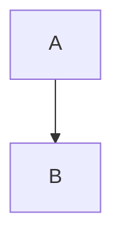

# Obsidian syntax

A [[Wikilink]], one with [[Target|an alias]], one to a [[Note#Heading]], a block [[Note#^abc123]].
An embed: ![[image.png|200]] and ![[Other note]].

Tags: #project #sub/tag #2026 is not a tag, nor is #.

==highlighted *text*==, H~2~O, x^2^, :smile: and :) emoji.

%% a comment line %%

Text with an %%inline comment%% in it.

%%
A comment block
over lines.
%%

> [!note] A callout
> With **content**.

> [!warning]- Folded
> Hidden body.
>
> - a list

> [!tip]+
> No title, open.

> [!custom-type]
> Unknown type.

- [ ] open task
- [x] done task
- [X] done, capital
- [/] half
- [-] cancelled
- [?] question
    - [ ] nested task

A block with an id. ^block-id

