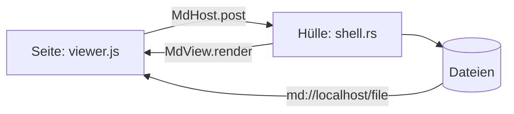

# Tauri-Check

Eine Notiz zum Durchklicken der Rust-Hülle. Oben steht, was man nur sieht, darunter, was man
tun muss. Die Kästchen lassen sich in der Leseansicht abhaken – das allein prüft schon, ob die
Hülle die Datei schreibt.

> [!important] So öffnen
> Als Ordner, damit Sidebar und Tabs dabei sind:
> `~/.cache/mdview-tauri/bin/mdview ~/.cache/mdview-tauri/dev/tests/tauri-check`

## Nur ansehen

### Dateien über `md://`

Beide Bilder kommen über das neue Protokoll. Fehlt eines, stimmt der Pfad-Weg nicht.

<!-- columns -->


<!-- column -->

![[tief.png]]

<!-- /columns -->

Das linke liegt neben der Notiz, das rechte im `Unterordner` und wird als Wikilink nur über
seinen Namen gefunden.

### Notiz in der Notiz

![[Zweite Notiz]]

### PDF

Ein Ausschnitt aus Seite 2, direkt aus dem PDF gezeichnet:

![[paper.pdf#page=2&rect=60,632,540,772]]

Die ganze Seite 3: [[paper.pdf#page=3|S. 3]]

### Formeln

In der Zeile $e^{i\pi} + 1 = 0$ und als Block:

$$
\hat{f}(\omega) = \int_{-\infty}^{\infty} f(t)\, e^{-i\omega t}\, dt
$$

### Diagramm



### Zeichnung

```svg
<svg xmlns="http://www.w3.org/2000/svg" width="420" height="110" viewBox="0 0 420 110">
  <rect x="10" y="30" width="120" height="50" rx="8" fill="none" stroke="currentColor" stroke-width="1.6"/>
  <text x="70" y="60" text-anchor="middle" font-family="SF Pro, Inter, sans-serif" font-size="13" fill="currentColor">Fenster-Thread</text>
  <rect x="290" y="30" width="120" height="50" rx="8" fill="#0a84ff" fill-opacity="0.12" stroke="#0a84ff" stroke-width="1.6"/>
  <text x="350" y="60" text-anchor="middle" font-family="SF Pro, Inter, sans-serif" font-size="13" fill="currentColor">Hüllen-Thread</text>
  <path d="M130 55 H282" stroke="currentColor" stroke-width="1.6" fill="none"/>
  <path d="M282 50 L290 55 L282 60 Z" fill="currentColor"/>
  <text x="210" y="46" text-anchor="middle" font-family="SF Pro, Inter, sans-serif" font-size="11" fill="currentColor">Ereignisse</text>
</svg>
```

### Code und Tabelle

```rust
fn file_url(path: &Path) -> String {
    format!("md://localhost/file{}", quote(&path.to_string_lossy()))
}
```

| Weg | Python-Hülle | Rust-Hülle |
|---|---|---|
| Seite → Hülle | `webkit.messageHandlers` | `MdHost.post` |
| Dateien | `file://` | `md://localhost/file` |
| Zweiter Start | `gdbus` im Launcher | Single-Instance-Plugin |

## Ausprobieren

### Fenster und Start

- [ ] Beim Öffnen blitzt nichts Magentafarbenes auf.
- [ ] Im Dock und in der Fensterliste steht das App-Icon, nicht ein Platzhalter.
- [ ] `mdview` ein zweites Mal im Terminal starten: kein neues Programm, das Fenster kommt nach vorn.
- [ ] Fenster schließen, gleich wieder öffnen: es ist sofort da (das Programm bleibt 15 Minuten liegen).
- [ ] Fenstergröße ändern, schließen, öffnen: die Größe ist geblieben.

### Lesen und Wechseln

- [ ] Dieses Kästchen abhaken: der Haken bleibt nach <kbd>Ctrl</kbd>+<kbd>R</kbd>.
- [ ] Klick auf [[Zweite Notiz]] öffnet sie; zurück mit dem Pfeil oben.
- [ ] Mittelklick auf [[Zweite Notiz#Ein Abschnitt|den Abschnitt]] öffnet einen eigenen Tab, an dieser Stelle.
- [ ] Klick auf den PDF-Ausschnitt oben öffnet das PDF auf Seite 2.
- [ ] Im PDF Text markieren und als Link kopieren, hier einfügen: der Link führt zurück an die Stelle.
- [ ] Zwei Finger auseinander im PDF vergrößern die Seite, nicht das ganze Fenster.
- [ ] Ein Link nach außen, <https://tauri.app>, öffnet den Browser und nicht im Fenster.

### Schreiben

- [ ] <kbd>Ctrl</kbd>+<kbd>E</kbd>: Quelltext ändern, zurück – die Datei ist gespeichert.
- [ ] <kbd>Ctrl</kbd>+<kbd>Alt</kbd>+<kbd>2</kbd>: im aktiven Modus ein Wort tippen, mit `git diff` nachsehen, dass nur diese Zeile anders ist.
- [ ] Ein Bild in die Zwischenablage nehmen (Screenshot) und mit <kbd>Ctrl</kbd>+<kbd>V</kbd> einfügen: es liegt als Datei neben der Notiz.
- [ ] Ein Bild aus dem Dateimanager auf die Notiz ziehen.
- [ ] Text aus dem Browser einfügen: Fett und Links kommen als Markdown an.
- [ ] Eine Formel im aktiven Modus öffnen und „als Bild kopieren“.
- [ ] Die Notiz in einem anderen Editor ändern und speichern: das Fenster zieht nach.
- [ ] Mitten im Schreiben das Fenster schließen: der letzte Stand ist in der Datei.

### Sidebar

- [ ] Neue Notiz anlegen, umbenennen, in den Papierkorb legen.
- [ ] Im Terminal eine Datei in den Ordner legen: sie erscheint von selbst in der Sidebar.
- [ ] Rechtsklick auf eine Datei: „Im Dateimanager zeigen“ und „Öffnen mit“.
- [ ] Alle Notizen als Kacheln: die Vorschau dieser Notiz zeigt das Bild.

### System

- [ ] Omarchy-Theme wechseln: die Farben folgen ohne Neustart.
- [ ] Drucken (<kbd>Ctrl</kbd>+<kbd>P</kbd>) öffnet den Druckdialog.
- [ ] Einstellungen öffnen: unten steht die Version (Commit und Datum).

> [!tip]- Wenn etwas nicht geht
> Mit `MDVIEW_DEBUG=1` im Terminal starten: die Seite schreibt dann nach stderr, und
> <kbd>Shift</kbd>+Rechtsklick bietet „Element untersuchen“. Vorher das laufende Programm
> beenden (`pkill -f target/release/mdview`), sonst übernimmt es den Start.
