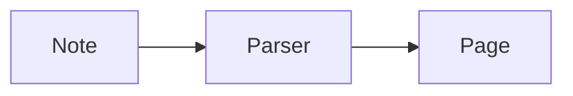

# Markdown Notes — features

Everything the app (`mdview`, `mdnotes`) does, with the Markdown it reads. Open this file in the app
itself: every example below is drawn as it would be in a note.

## Starting it

| Command | What opens |
|---|---|
| `mdview FILE.md` | the note, in a window of its own |
| `mdview FOLDER` | the folder: a sidebar with its notes, the note opened last |
| `mdview` | the folder opened last |
| `mdview FILE.pdf` | the PDF, in the built-in viewer |

The app stays resident for a while after its last window closes, so the next one opens at once.
A file changed by another program is read again as it changes.

## Three modes

The switch at the top right, or `Ctrl+Alt+1` / `2` / `3`.

| Mode | Key | What it is |
|---|---|---|
| Source | `Ctrl+Alt+1`, `Ctrl+E` | the Markdown itself, highlighted, edited in place |
| Active | `Ctrl+Alt+2` | the rendered note, written in directly; the file changes only where it was edited |
| Reading | `Ctrl+Alt+3` | the rendered note, read only (tasks can still be ticked) |

Edits are saved by themselves. The settings (`Ctrl+,`) choose the mode a new window starts in.

## Markdown that is rendered

### Text

*Italic*, **bold**, ***both***, ~~struck~~, ==highlighted==, `code`, H~2~O, x^2^, a [link](https://example.com),
a bare address https://example.com, a key <kbd>Ctrl</kbd>, an emoji :tada:, a footnote[^1].

```markdown
*italic*  **bold**  ~~struck~~  ==highlighted==  `code`  H~2~O  x^2^
[link](https://example.com)  <kbd>Ctrl</kbd>  :tada:  footnote[^1]

[^1]: The footnote's text.
```

[^1]: Footnotes are collected at the end of the note, numbered in reading order.

Comments are not shown: `%% Obsidian's %%` and `<!-- HTML's -->`.

### Headings, rules, lists

`#` to `######`, a rule with `---`, bullets, numbers, nested lists, definition lists:

Term
: What it means.

```markdown
- bullet
  - nested
1. numbered

Term
: What it means.
```

### Tasks

- [ ] open
- [x] done

```markdown
- [ ] open
- [x] done
```

A click ticks a task in every mode.

### Tags

`#tag` anywhere in the text: #example #nested/tag

### Quotes and decorations

> A plain quote.

> [!block|green]
> A tinted block.

> [!focus|red]
> A quote with a bar in a colour.

> [!block-focus|blue]
> Both at once.

```markdown
> A plain quote.

> [!block|green]
> A tinted block.

> [!focus|red]
> A bar in a colour.

> [!block-focus|blue]
> Both.
```

Colours: `red` `orange` `yellow` `green` `cyan` `blue` `magenta`. Without one, the block is grey and
the bar is the accent colour.

### Callouts

> [!info] A title of its own
> The text of the callout.

> [!tip]- Folded
> Shown after a click on the title. (`+` instead of `-`: foldable, open.)

```markdown
> [!info] A title of its own
> The text.

> [!tip]- Folded
> Shown after a click.
```

Kinds: `note` `info` `todo` `abstract` `tip` `success` `question` `warning` `failure` `danger` `bug`
`example` `quote` `important`. Also read: `summary` `tldr` `hint` `check` `done` `help` `faq`
`attention` `caution` `fail` `missing` `error` `cite`. An unknown kind is drawn as a note.

### Code

```python
def greet(name):
    return f"Hello, {name}"
```

A fence with a language name is highlighted; hovering shows the language and a Copy button.

### Tables

| Name | Qty |
|---|--:|
| apple | 3 |
| pear | 12 |

A table as wide as the text column has the line `<!-- wide -->` right before it:

```markdown
<!-- wide -->
| Name | Qty |
|---|--:|
| apple | 3 |
```

### Columns

<!-- columns 2:1 -->

**Left**, twice as wide.

<!-- column -->

**Right.**

<!-- /columns -->

```markdown
<!-- columns 2:1 -->

Left, twice as wide.

<!-- column -->

Right.

<!-- /columns -->
```

The ratio is optional (`<!-- columns -->` makes them alike). Only among the note's own blocks — not
in a list or a quote, not inside each other. In a narrow window, and in any other Markdown program,
the blocks simply stand one under the other.

### Formulas (KaTeX)

In the line: $e^{i\pi} + 1 = 0$. As a block:

$$
\int_0^\infty e^{-x^2}\,dx = \frac{\sqrt{\pi}}{2}
$$

```markdown
In the line: $e^{i\pi} + 1 = 0$

$$
\int_0^\infty e^{-x^2}\,dx = \frac{\sqrt{\pi}}{2}
$$
```

A fence named `math` is a block formula too. A price like $5 is not taken for a formula.

### Diagrams (Mermaid)



A fence named `mermaid`; the diagram takes the app's colours.

### Pictures from SVG code

```svg
<svg xmlns="http://www.w3.org/2000/svg" width="240" height="70" viewBox="0 0 240 70">
  <rect x="4" y="10" width="80" height="50" rx="10" fill="#0071e3"/>
  <circle cx="130" cy="35" r="24" fill="none" stroke="#d70015" stroke-width="4"/>
  <text x="170" y="42" font-size="18" fill="currentColor">SVG</text>
</svg>
```

A fence named `svg` holding one `<svg>` element is drawn as the picture, centred. Scripts, event
handlers and foreign content are left out. Code that is not valid SVG stays a code block.
`fill="currentColor"` takes the text's colour, so it reads in light and dark.

### Pictures and other files

```markdown

![[picture.png]]
```

How large a picture shows is written at the end of its description, as Obsidian writes a width:

```markdown
        400 px wide
![[tree.png|400]]              the same, for an embed
![[tree.png|full]]             as wide as the text column
![[paper.pdf#page=3|full]]     an embedded PDF page, likewise
```

In the active mode the size is a choice — its own size, Small (240), Medium (400), Large (640), Full
width — in the menu of a picture or an embed (right click → Size), in a picture's popover (double
click or Enter on it) and in the dialog of an embed.

Paths are relative to the note. SVG files and embedded PDF pages stand centred. A double click shows a picture large.
A picture alone in its paragraph is a block of its own in the active mode: a click selects it as a
whole, the handle moves it, right click has its size and Edit… (its Markdown). In a line with text
a picture stays part of the line.
`Ctrl+V` with a picture on the clipboard saves it beside the note (or in `./assets`, a setting) and
embeds it; picture files dropped on the note do the same.

### Links between notes

```markdown
[[Other note]]                 a link to a note of that name
[[Other note|shown text]]      with a text of its own
[[Other note#Heading]]         to a heading in it
![[Other note]]                the note itself, shown in place
```

A link to a note that does not exist is drawn dashed. `Alt+←` / `Alt+→` go back and forward.

### Properties (frontmatter)

YAML between `---` lines at the very top is shown as a foldable table of properties. In the active
mode simple values open as a form.

```markdown
---
title: A note
tags: [one, two]
draft: true
date: 2026-10-04
color: green
---
```

`color` (one of the seven colours above) marks the note in All Notes: a dot in that colour before its name on the tile, its sign in that colour in the list.

### HTML

Raw HTML in a note is rendered (`<br>`, `<details>`, ``, inline `<svg>` …).

## Writing in the active mode

- **Typing Markdown** formats as you type (`# `, `- `, `1. `, `> `, `**bold**`, `` `code` `` …).
- **Backspace at the start of a line** takes its formatting off first (a heading becomes text, a list
  item loses its bullet); pressed again it joins the line above — in a list the item above, so
  holding Backspace goes up through a list line by line.
- **`/` menu** at the start of an empty line, or in a line with text: text styles, lists, formats,
  decorations, colours, callouts, columns, code block, formula, table, divider, picture, footnote,
  graphic, and actions on the block (duplicate, move, select, copy, delete). Typing filters it.
- **Formatting bar** over a selection: bold, italic, strikethrough, code, link, formula, paragraph style.
- **Context menu** (right click): cut, copy, paste, paste and match style, add link, format,
  paragraph, insert, settings.
- **Blocks as wholes**: a handle beside each block selects and drags it; `Esc` takes the block the
  caret is in. On selected blocks: arrows move among them, `Alt+↑/↓` moves them, `Ctrl+D` duplicates,
  `Space` adds an empty block below, `Backspace` deletes. `Ctrl+click` picks blocks one by one; a
  rectangle pulled from the empty space selects those it reaches.
- **Tables** are edited in their cells; handles over a column and beside a row open a menu and can
  be dragged to move it.
- **Code blocks, block formulas, properties, raw HTML** open in a dialog with an editor (bracket
  matching, `Ctrl+F`, LaTeX completion) and a live preview for formulas, Mermaid and SVG.
- **Formula dialog**: block or in the line, Copy LaTeX, Copy as Picture. LaTeX Suite snippets work
  in it and between dollars in the text (own snippets: `~/.config/mdview/snippets.js`).
- **Links**: `Ctrl+K`; with the caret in a link a small popover shows its target.
- **Panel at the right** (`Ctrl+Alt+P`): *Insert* — tiles for everything that can be put in, click
  or drag; *Format* — the styles of the block the caret is in.
- **Graphic** (`/` → Graphic): describe a figure and it is drawn as an SVG file beside the note.
- **Suggestions while typing** (a setting, off by default): the next words in grey, `Tab` takes them.
- **Undo** follows across the three modes.

## A folder of notes

- **Tabs**: a strip above the note with the notes and PDFs that are open, each where it was left
  and with its own way back. `Ctrl`+click or the middle button on a note — in the sidebar, among
  the tiles, on a link — opens it in a tab of its own, as does Open in New Tab in a file's menu; a
  plain click opens it in the tab shown, or goes to the tab the note already has. `+` (`Ctrl+T`)
  makes an empty tab, which shows All Notes to choose from; the house before the tabs shows All
  Notes over the note. The ✕ in the icon's place under the pointer, the middle button or `Ctrl+W`
  closes a tab (the last one: the window), `Ctrl+Shift+T` opens the one closed last again.
  `Ctrl+Tab` and `Ctrl+Shift+Tab` go to the next and the one before, `Ctrl+1` … `8` to a tab by
  its place, `Ctrl+9` to the last. A tab can be pulled to another place; a right click has New
  Tab, Reopen Closed Tab, Close Tab, Close Other Tabs. The tabs of a folder are there again the
  next time it is opened.
- **Sidebar** (`Ctrl+Alt+S`): the folder's notes and folders. The clock is the folder's history (below). `+` makes a note or folder, a right
  click on a file has Open in New Tab, Open in Default App, Open With…, Show in Finder, Rename (`F2`), Move to Trash
  (`Del`); a right click on the empty room has New Note, New Folder and the order of the notes. Its
  edge can be pulled wider or away. `Aa` switches between file names and the notes' titles.
- **Order of the notes**: Last Opened (the default), Name, Date Modified.
- **Beside notes** the sidebar can list PDFs (on by default), pictures, sound and video, and other
  files (settings).
- **All Notes** (`Ctrl+Alt+G`): every note as a tile showing its beginning, or as a list. Two
  switches at the head: *All Notes* (grouped by folder) or *Folders* (one folder at a time, click
  into its folders, `Backspace` goes up), and tiles or list. It opens in the folder of the note on
  screen. Arrows move, `Enter` opens, `F2` renames, `Del` trashes; a right click has the file menu.
- **Where a note was left**: a note opens at the place it was scrolled to — coming back from a
  PDF or another note, and in a new window — and in the mode it was in.
- **Open another folder**: `Ctrl+Alt+O`. **New note**: `Ctrl+N`.

## History

A folder can keep a history of its notes: every change, as a version that can be looked at and
put back. It is switched on per folder, on purpose; opening a folder keeps nothing. Under it is
an ordinary Git repository in the folder (`.git`), with a small file of the app's beside it
(`.mdview/project.json`) — the two together make the folder a *project*. Nothing leaves the
computer.

- **Switching it on**: the clock at the head of the sidebar (dimmed while the app keeps no
  history here) › Turn On History, or Settings › History › Turn On.
- **What is kept, and when**: whatever changes in the folder — written here or by another
  program — becomes a version once nothing more has changed for a while (30 seconds; settings),
  at once when the folder's last window closes, and at once with `Ctrl+S`. A version names the device it was made on.
  A file over 50 MB is left out, and said so once. What `.gitignore` leaves out is left out.
- **A note's history** (`Ctrl+Alt+H`, or the clock › Show History of This Note; what is typed and
  not saved yet is saved first): its versions at
  the left, newest first, and at the right what the chosen one changed — lines added and taken
  out, the words that differ marked, the lines that stayed counted. The choice at the head
  compares with the note as it is now instead. `↑` `↓` go through the versions. A note that was
  renamed keeps its versions.
- **Restore This Version** makes the note what it was then. That is a new version: nothing of the
  history is lost by it.
- **A folder inside a project** belongs to it: its notes are kept there, and nothing is switched
  on again.
- **A folder with projects in it**, switched on, asks once: take them in — there is one project
  from then on, and their versions are its own — or leave them separate, each with its history.
- **A Git repository that is not the app's** (source code, say) is never written to. In a folder
  of it the clock says who keeps the history, and a note's history can be read. A repository that
  is the folder itself can be taken over as a project (Use This Repository for History…): from
  then on the app commits in it, on the branch that is checked out.
- **Switching it off**: the clock › Turn Off History, or Settings › History › Turn Off. What
  waits is kept first; then nothing more is. The versions stay and can be read, and switching it
  on again goes on where it stopped. (To be rid of the history altogether, delete the folder's
  `.git`.)
- **Settings › History** shows where the folder stands: on or off, the repository's name and
  place, its branch, how many versions, the last one, and what is not kept yet.

## Finding

- **Find in the note**: `Ctrl+F` or `/` (when not typing); `Enter` / `Shift+Enter` next and previous.
- **Outline**: `Ctrl+Shift+O` — the note's headings, a click goes there.

## PDFs

A link to a PDF opens it in the window; nothing is ever written into the PDF. An embedded page or
region is a picture in the note: a double click shows it large, `Ctrl`+click or **Go to PDF** in its
menu opens the PDF at that place, and in the active mode its menu also has Edit…, Size and Adjust
Region….

```markdown
[[paper.pdf#page=3]]                                   a link to a page
[[paper.pdf#page=3&selection=4,0,5,20&color=red|p. 3]] a link to selected text (shows as a highlight)
![[paper.pdf#page=3]]                                  the page, in the note
![[paper.pdf#page=3&rect=72,400,300,520]]              a region of the page
```

**Adjusting a region.** In the active mode a click on an embed that stands on a line of its own opens
its dialog; **Adjust Region** there (or right click → Adjust Region…) shows the whole page with a frame on it. Move the frame, pull its
edges and corners, pull anywhere else for a new one, step to another page — `page=` and `rect=` in the
text follow. **Show Result** shows the embed as the note will; Done writes it.

In the viewer: select text, then a colour or `Ctrl+Shift+C` copies a link to it (as a callout, a
quote, a link or an embed). Every such link in the notes shows as a highlight in the PDF; a double
click on one opens the note. Side panel: outline, pages, notes. Larger and smaller: two fingers on
the touchpad, `Ctrl` (or `Super`) with `+` and `−`, `Ctrl` with the wheel; `Ctrl+0` fits the width
again. Keys: `+` `−` zoom, `W` fit width,
`H` fit page, `G` go to page, `O` outline, `T` pages, `N` notes, `R` region, `Alt+←` back.

## Keys

| Key | Does |
|---|---|
| `Ctrl+Alt+1` / `2` / `3` | source / active / reading |
| `Ctrl+E` | reading ↔ source |
| `Ctrl+F`, `/` | find |
| `Ctrl+Shift+O` | outline |
| `Ctrl+Alt+S` | sidebar |
| `Ctrl+Alt+G` | All Notes |
| `Ctrl+Alt+P` | panel (active mode) |
| `Ctrl+Alt+O` | open a folder |
| `Ctrl+Alt+H` | history of the note |
| `Ctrl+N` | new note |
| `Ctrl+T` / `Ctrl+W` / `Ctrl+Shift+T` | new tab / close the tab / open the closed one again (folder windows) |
| `Ctrl+Tab` / `Ctrl+Shift+Tab` | next tab / the one before |
| `Ctrl+1` … `9` | the tab at that place (`9`: the last) |
| `Ctrl+,` | settings |
| `Ctrl+B` / `I` / `K` | bold / italic / link |
| `Ctrl+Shift+X` | strikethrough |
| `Ctrl+Shift+V` | paste and match style |
| `Ctrl+D` | duplicate the block |
| `Alt+←` / `Alt+→` | back / forward |
| `Ctrl` or `Super` + `+` / `−` | the note's text larger / smaller (50 % to 250 %); in a PDF: its pages |
| `Ctrl+0` | the note at 100 % again; in a PDF: fit the width |

## Settings (`Ctrl+,`)

A window of its own (also the gear at the lower left): the groups at the left, their settings at
the right. A change takes effect at once.

| Group | What is set |
|---|---|
| General | language of the app's texts (English, German), the mode a new window starts in |
| Appearance | text size of a note, width of the text column, sharper text (letters on whole pixels; at the next start) |
| Sidebar | order of the notes, what it lists beside notes (PDFs, pictures, sound and video, other files) |
| All Notes | all notes or one folder at a time, tiles or a list |
| History | the folder's history at a glance (and turning it on), how long a change waits to be kept, this device's name |
| Editing | formatting bar, `/` menu, Markdown shown at the caret, typographic quotes, wrapping of new paragraphs, where pasted pictures go |
| New Markdown | as the document does it, or fixed marks for bullets, numbers, italic and bold |
| Formulas | the formula editor's helpers (snippets, fraction with `/`, matrix keys, Tab leaves brackets …) |
| PDFs | what a link to selected text is copied as, copy on select |
| Writing Help | suggestions while typing, the Gemini API key, the model |
| About | version, this guide, the settings folder |

The Gemini key is typed into the settings and kept in `~/.config/mdview/.env`, readable by the
user alone; the window only ever shows its last four signs. A key in the environment
(`GEMINI_API_KEY`) takes precedence.

## Look

Colours follow the Omarchy theme, light or dark. Context menus and the `/` menu are dark plates;
the app's own icons are SF Symbols where that font is installed. Motion follows henri-ui.
