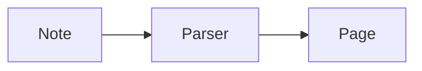

# Markdown Notes — features

Everything the app (`mdview`, `mdnotes`) does, with the Markdown it reads. Open this file in the app
itself: every example below is drawn as it would be in a note.

## Starting it

| Command | What opens |
|---|---|
| `mdview FILE.md` | the note, in a window of its own |
| `mdview FOLDER` | the folder: a sidebar with its notes, the note opened last |
| `mdview` | the folder opened last |
| `mdview FILE.pdf` | the PDF, in the built-in viewer |

The app stays resident for a while after its last window closes, so the next one opens at once.
A file changed by another program is read again as it changes.

## Three modes

The switch at the top right, or `Ctrl+Alt+1` / `2` / `3`.

| Mode | Key | What it is |
|---|---|---|
| Source | `Ctrl+Alt+1`, `Ctrl+E` | the Markdown itself, highlighted, edited in place |
| Active | `Ctrl+Alt+2` | the rendered note, written in directly; the file changes only where it was edited |
| Reading | `Ctrl+Alt+3` | the rendered note, read only (tasks can still be ticked) |

Edits are saved by themselves. The settings (`Ctrl+,`) choose the mode a new window starts in.

## Markdown that is rendered

### Text

*Italic*, **bold**, ***both***, ~~struck~~, ==highlighted==, `code`, H~2~O, x^2^, a [link](https://example.com),
a bare address https://example.com, a key <kbd>Ctrl</kbd>, an emoji :tada:, a footnote[^1].

```markdown
*italic*  **bold**  ~~struck~~  ==highlighted==  `code`  H~2~O  x^2^
[link](https://example.com)  <kbd>Ctrl</kbd>  :tada:  footnote[^1]

[^1]: The footnote's text.
```

[^1]: Footnotes are collected at the end of the note, numbered in reading order.

Comments are not shown: `%% Obsidian's %%` and `<!-- HTML's -->`.

### Headings, rules, lists

`#` to `######`, a rule with `---`, bullets, numbers, nested lists, definition lists:

Term
: What it means.

```markdown
- bullet
  - nested
1. numbered

Term
: What it means.
```

### Tasks

- [ ] open
- [x] done

```markdown
- [ ] open
- [x] done
```

A click ticks a task in every mode.

### Tags

`#tag` anywhere in the text: #example #nested/tag

### Quotes and decorations

> A plain quote.

> [!block|green]
> A tinted block.

> [!focus|red]
> A quote with a bar in a colour.

> [!block-focus|blue]
> Both at once.

```markdown
> A plain quote.

> [!block|green]
> A tinted block.

> [!focus|red]
> A bar in a colour.

> [!block-focus|blue]
> Both.
```

Colours: `red` `orange` `yellow` `green` `cyan` `blue` `magenta`. Without one, the block is grey and
the bar is the accent colour.

### Callouts

> [!info] A title of its own
> The text of the callout.

> [!tip]- Folded
> Shown after a click on the title. (`+` instead of `-`: foldable, open.)

```markdown
> [!info] A title of its own
> The text.

> [!tip]- Folded
> Shown after a click.
```

Kinds: `note` `info` `todo` `abstract` `tip` `success` `question` `warning` `failure` `danger` `bug`
`example` `quote` `important`. Also read: `summary` `tldr` `hint` `check` `done` `help` `faq`
`attention` `caution` `fail` `missing` `error` `cite`. An unknown kind is drawn as a note.

In the active mode a callout that folds is edited like any other: a click on its title's bar
folds and unfolds it, the caret come into a folded one unfolds it. `/` › Callout › Collapsible
makes a callout fold (and Open at First says how it starts).

### Code

```python
def greet(name):
    return f"Hello, {name}"
```

A fence with a language name is highlighted; hovering shows the language and a Copy button.
`hide` after the language puts the code away behind a card — with a title, if one follows, else
the code's first line — and a click shows it in a window of its own:

````markdown
```verilog hide The ALU
module alu(…);
```
````

In the active mode the code block's menu has Hide the Code, and its dialog a Hide button. Other
Markdown programs show such a block as any other. The card has a size, as a file block has:
`hide:small` (a chip in the line's height) or `hide:large`, from the block's menu › Size.

**A file as code.** A file that is text — source code, a list of files, a log — stands in the note
as the code it is, read from the file each time the note is opened:

```markdown
![[src/alu.sv]]                        the whole file, highlighted by its ending
![[src/alu.sv#L10-L42]]                lines 10 to 42 of it
![[src/alu.sv|hide]]                   put away behind a card that names the file
![[src/alu.sv#L10-L42|hide:large The ALU]]   … with a size and a title
```

The block names its file (a click opens it). In the active mode a file block of such a file has
Show as Code in its menu, and the code has Hide the Code, Size and Show as File.

A Mermaid diagram and a fence of SVG grow to the window's size by a double click, as a picture
does (in the active mode: right click › Show Large).

Hardware descriptions are among the languages: `verilog` (also `systemverilog`, `sv`, `svh`),
`vhdl`, `tcl` — and `filelist` (also `f`), the list of sources and options a simulator is handed.

### Tables

| Name | Qty |
|---|--:|
| apple | 3 |
| pear | 12 |

A table stands as a sheet: every cell in its lines, as wide as the text column. A line right
before it says otherwise — `narrow`: only as wide as what it holds; `head=…`: its head row in a
colour, one of the theme's by name (red, orange, yellow, green, cyan, blue, magenta) or any
colour written as `#rrggbb`:

```markdown
<!-- table narrow head=#cfeefc -->
| Name | Qty |
|---|--:|
| apple | 3 |
```

In the active mode: the table's `…` beside its upper right corner (or a right click) has Full
Width and Header Color (the theme's colours, or Custom… for any other); the three dots in a row
move the row, those above a column the column. A table selected as a whole wears a thin line.
(`<!-- wide -->`, the line of before, is still read.)

A rule has four looks, by how its line is written: `---` a thin line, `***` three dots, `___` a
heavy line, `- - -` a dotted one. The panel's Insert Line puts each in.

### Columns

<!-- columns 2:1 -->

**Left**, twice as wide.

<!-- column -->

**Right.**

<!-- /columns -->

```markdown
<!-- columns 2:1 -->

Left, twice as wide.

<!-- column -->

Right.

<!-- /columns -->
```

The ratio is optional (`<!-- columns -->` makes them alike). Only among the note's own blocks — not
in a list or a quote, not inside each other. In a narrow window, and in any other Markdown program,
the blocks simply stand one under the other.

### Quick notes

`mdview --quick` opens a window for writing something down at once: a list of short notes at the
left — what each says first, when it was written, how it goes on; the newest first — and the note
at the right. The + (or Ctrl+N; another key can be set in the settings) makes a new note without
asking for a name: its file is named after its first line when the note is left, and a note left
empty is gone again. The notes are Markdown files in one folder (Documents/Notizen/QuickNotes,
or the folder the settings name), so they are notes like any other everywhere else.

### Pages in a note

A note can hold pages of its own. On the page it lies on, a page is a line with its name; a click
opens it, and it is shown alone — with the way back above it.

<!-- page: An example page -->

This text is on a page of its own. Pages can lie in pages:

<!-- page: One further in -->

… as deep as it is useful.

<!-- /page -->

<!-- /page -->

```markdown
<!-- page: An example page -->

This text is on a page of its own.

<!-- /page -->
```

The note stays one Markdown file: in the source editor, and in any other Markdown program, a page's
text simply stands where it is written. In the active mode a page is made from the `/` menu
(Page); its name is typed above its text — in the reading view as well, where it is written at
once — or changed from the page it lies on: right click on its line › Rename…. Its line can be
moved, copied and deleted like any block — the page goes with it.

### A link to a note as a block

A link to another note stands in the text, or — a block of its own — looks as a page's line does:
a row or a card, in one of the theme's colours. Right click on the link › Style. A link in the
text that is made a row or a card goes out of the text and stands under the block it stood in;
In Text puts it back as a line of its own. In the file the look is a comment behind the link, so
any other Markdown program shows the link:

```markdown
[[Plan]] <!-- link row -->
[[Plan|The plan]] <!-- link card blue -->
```

### Formulas (KaTeX)

In the line: $e^{i\pi} + 1 = 0$. As a block:

$$
\int_0^\infty e^{-x^2}\,dx = \frac{\sqrt{\pi}}{2}
$$

```markdown
In the line: $e^{i\pi} + 1 = 0$

$$
\int_0^\infty e^{-x^2}\,dx = \frac{\sqrt{\pi}}{2}
$$
```

A fence named `math` is a block formula too. A price like $5 is not taken for a formula.

### Diagrams (Mermaid)



A fence named `mermaid`; the diagram takes the app's colours.

### Pictures from SVG code

```svg
<svg xmlns="http://www.w3.org/2000/svg" width="240" height="70" viewBox="0 0 240 70">
  <rect x="4" y="10" width="80" height="50" rx="10" fill="#0071e3"/>
  <circle cx="130" cy="35" r="24" fill="none" stroke="#d70015" stroke-width="4"/>
  <text x="170" y="42" font-size="18" fill="currentColor">SVG</text>
</svg>
```

A fence named `svg` holding one `<svg>` element is drawn as the picture, centred. Scripts, event
handlers and foreign content are left out. Code that is not valid SVG stays a code block.
`fill="currentColor"` takes the text's colour, so it reads in light and dark.

### Pictures and other files

```markdown

![[picture.png]]
```

How large a picture shows is written at the end of its description, as Obsidian writes a width:

```markdown
        400 px wide
![[tree.png|400]]              the same, for an embed
![[tree.png|full]]             as wide as the text column
![[paper.pdf#page=3|full]]     an embedded PDF page, likewise
```

In the active mode the size is a choice — its own size, Small (240), Medium (400), Large (640), Full
width — in the menu of a picture or an embed (right click → Size), in a picture's popover (double
click or Enter on it) and in the dialog of an embed.

Paths are relative to the note. A picture alone in its paragraph is a block of its own: it has the
line to itself and stands in its middle, as embedded PDF pages do. A double click shows a picture large.
A picture alone in its paragraph is a block of its own in the active mode: a click selects it as a
whole, the handle moves it, right click has its size and Edit… (its Markdown). In a line with text
a picture stays part of the line.
`Ctrl+V` with a picture on the clipboard saves it beside the note (or in `./assets`, a setting) and
embeds it; picture files dropped on the note do the same.

**Any file** can be dropped on a note in the active mode. It is kept where pictures go, and stands
in the note as a *file block*: a card that names it, and a click opens it or hands it out. In
Markdown a file block is a paragraph that is nothing but a link to the file:

```markdown
[report.zip](report.zip)
```

A file block comes in three sizes — a small chip, the card, a large card as wide as the text
that also says what kind of file it is — chosen in its menu (right click › Size). The size
stands where a link has its title: `[report.zip](report.zip "large")`, or `"small"`.

A file that can be shown in the note itself — a picture, a PDF, sound, film — is embedded on
request: right click on its block › Show as Picture (a picture's file) or Embed in the Note. The
other way round, a picture's or an embed's menu has Show as File.

A picture or file the app itself put beside the note (pasted, dropped) goes again when the note no
longer shows it — but not at once: it stays for an hour first, so that cutting and pasting it,
or undoing its removal, finds it where it was.

In the active mode a picture or a file is put in from the `/` menu, the Insert panel or the
menu's Insert › Picture / File: the system's own window for files opens, and what is chosen there
is kept beside the note and stands at the caret — as a file dropped on the note does.

### Whiteboards

A whiteboard is a block in a note: a board without edges to draw on, opened from the note and
shut back into it.

- **Making one**: `/whiteboard` in the active mode, or the Whiteboard tile of the panel's Insert
  tab, or Insert in the menu of a right click. The board opens at once.
- **In the note** it stands as a picture of what is on it, in a frame — in every mode, in the
  browser and in a shared note. A click opens it (in the active mode too; the block is chosen by
  its handle or with `Esc`, like any block, and can be moved, copied and deleted like one).
- **Drawn clean by Claude** (the desktop application; a right click on the board's block, Draw
  Clean with Claude…): what was scribbled on the board — a circuit, a diagram, a scheme — is
  shown to Claude as a picture and drawn as a clean figure. The dialog shows the scribble and
  the figure side by side and starts at once; the figure is changed by saying what to change,
  or drawn again. Insert puts it directly under the board, as its SVG in the note (a fence of
  `svg`, which shows as a picture). The board's picture is sent to Anthropic for that.
- **The board** fills the window. Back to the note: the arrow at the top left, `Esc` or `Ctrl+W`.
- **What the hand does** is chosen in the bar at the top: the lasso (`V` or `L`, in hand when a
  board opens), the pens (`P`), the eraser (`E`), text (`T`), shapes (`S`), then Picture, and
  under `+` a sticky note (`N`), a table and a link. Each tool but the lasso has a small tray
  of its own with what it is set to; the tray changes with the tool.
- **The pens**: pen (`P`), fineliner (`F`), marker (`M`, see-through) and pencil (`B`, with a
  grain), and the ruler. Under them how broad the line is — pressed, the widths open, and how
  see-through the line is (a press on the pen in hand opens the same) — and three colours at
  hand. The colour in use, pressed again, opens all the colours; the one chosen there takes
  its place among the three. Each pen keeps its own width, its own colour and its own three.
- **The eraser**'s tray: whether it takes whole strokes or the parts it passes over, and how
  large it is.
- **A stroke made clean**: rest the hand at the end of a stroke before lifting it, and a line
  becomes straight (its end still follows the hand), a ring a circle or an ellipse, a box a
  rectangle, three sides a triangle.
- **The ruler** (`R`, the last thing in the tray) lies across the board: a stroke begun at one
  of its long edges runs straight along it. It is moved by its middle and turned by its ends
  (`Shift`: in steps of 15°); its angle stands in its middle.
- **The tray** stands upright at the right edge. It goes where it is pulled — by any part of
  it, a tool too: let go near an edge of the window it lies along that edge; let go in a
  corner it shrinks to a round sign of the tool in hand, which a tap opens again. The small
  arrow at its end shrinks it too.
- **The lasso** chooses and moves whatever is on the board, strokes of ink included: a click,
  `Shift` and a click for more, `Ctrl+A` for all; a pen draws a loop around what it wants, a
  mouse pulls a box from the bare board. What is chosen is pulled to another place — several
  things, or strokes, anywhere in their frame —, copied (`Ctrl+D`), deleted (`Delete`), nudged
  with the arrow keys (`Shift`: ten pixels). Strokes alone are pulled larger or smaller at the
  corners of their frame, and take another colour in the small bar beside them. `Esc`, or a
  click or tap on the bare board, lets go.
- `Ctrl+Z` takes a step back, `Ctrl+Shift+Z` brings it again.
- **Shapes**: the shape tool's tray holds a rectangle, a rounded one, an ellipse, a triangle,
  a diamond, a star, a hexagon, a line and an arrow, how broad their outline is, and its
  colour (the one well opens the colours). The shape in the tray is pulled open on the board
  from corner to corner (`Shift`: as high as wide; a line in steps of 45°); a tap puts one of
  the usual size there. With the first thing in the tray — drawn by hand — a shape is drawn
  freely and made clean when the hand lets go: a straight line, a circle or an ellipse and a
  rectangle become things of the board, a triangle a clean stroke. What was just made is
  chosen: pulled at its dots at once, it is sized.
- **Text**: with the text tool a click or tap on the bare board begins a text there, and one
  click on a text types in it. Its tray sets the size, bold, italic, underlined, where the
  text stands and its colour — for the text being typed or chosen, and for every text begun
  after it on this board. A click beside the text ends the typing.
- **Picture** (in the bar at the top) asks for picture files from this device.
- **What is chosen** is moved by pulling it — it comes to rest where an edge or its middle
  meets another's, a line shows where (`Alt`: nothing holds it; `Shift`: straight along or up) —,
  pulled to size at its dots (`Shift` at a corner keeps its proportions), turned at the knob
  above it (`Shift`: in steps of 45°), nudged with the arrow keys. A line is moved by its two
  ends. Clicked twice, or with `Enter`, it takes text; `Esc` or a click beside it ends that.
- **Its look** is in the small bar beside it: fill, border, text (size, bold, italic,
  underlined, where it stands, its colour), a line's arrowheads; under Arrange: align (with
  several chosen), Group (`Ctrl+G`, apart again with `Ctrl+Shift+G`), Bring to Front and Send
  to Back (`Ctrl+Shift+F` / `B`), Lock (`Ctrl+L`). Copy, cut and paste with `Ctrl+C`, `X`, `V`,
  a copy beside it with `Ctrl+D`, gone with `Delete`.
- **Links and files**: Link under `+` in the bar at the top takes an address and puts a card for it on
  the board; any file dropped on the board that is no picture is kept beside the board and
  stands on it as a card with its name. A card clicked twice, or Open in its bar, opens what
  it stands for — an address in the browser, a file in the program for its kind.
- **Pictures**: paste one (`Ctrl+V`) or drop picture files on the board. Crop in a picture's bar
  makes its frame its edge: a dot pulled in cuts the picture there (never beyond the whole
  picture), Show the Whole Picture brings it back. Each is kept as a file
  beside the board's own and belongs to the note; it is chosen, moved, turned and sized (at its
  corners, in its proportions) like the rest. The board's picture in the note holds a small
  copy of it. Taken off the board it goes to the trash an hour later, as a picture taken out of
  a note does.
- **Tables** (under `+` in the bar at the top): three by three to begin with, the first
  cell ready to be typed in. `Tab` goes on to the next cell, `Shift+Tab` back; a row grows with
  its text; a cell clicked twice is typed in. In a table's bar, Table adds and takes away rows
  and columns at its end, sets the size of its text and whether the first row is its head. A
  table is pulled to size at its dots — its columns and rows keep their shares — and stands
  upright.
- **A look taken along**: `Ctrl+Alt+C` takes the chosen item's fill, border and text setting,
  `Ctrl+Alt+V` gives them to what is chosen then (also under Arrange). Use as Style for New
  Ones, there too, makes it the look every new item of that kind begins with on this board.
- Ink lies over the things on the board, as a pen writes over what is pinned to a wall.
- **With a pen** (an Apple Pencil, any pen the system knows as one): it does what the tool in
  hand does — draws, rubs out, draws the lasso's loop, pulls a shape open, begins a text. Its
  pressure makes the pen's line broader and finer, and a pencil held flat draws a broad faint
  band. Held over the board before it touches, its tip shows where it will come down. Once a
  pen has been used, a finger no longer draws but moves the board, and a hand lying on the
  glass beside the pen does nothing; Draw with Finger under More changes that.
- **Pen and fingers together**: what is chosen is moved by a finger laid on it, anywhere in
  its frame. A finger's tap on a thing chooses it, whatever tool is in hand, and the tool
  stays in hand: the finger moves the thing, the pen takes hold of it too — at its dots it
  pulls it to size, at its knob it turns it, on it it moves it — while on the bare board
  beside it the pen goes on drawing; a tap beside it lets it go. A pen's double tap, its
  squeeze and its turning about its own axis do not reach a web page: they are not there.
- **With fingers** (a tablet, a phone): one finger works the tool in hand. With the lasso a
  finger takes a thing and moves it; on the bare board it moves the board, and held still for
  a moment first it pulls a box over what is to be chosen. Two fingers move the board and make
  it larger or smaller; both on one thing, they turn it. The board let go by one finger in mid-move
  runs on and comes to rest (a finger put down holds it); two fingers leave it where they left it. Two fingers tapped together take the last
  step back, three bring it again. On a narrow screen the bar of tools stands under the top
  row and the tray above the bottom row.
- **Connectors** (the button at the bottom right): the chosen item has an arrow off each of its
  sides. Pulled onto another item, a line joins the two; let go over the bare board, a choice of
  shapes asks what is to stand at its end — it has the first one's size and look. A joined line
  goes where its items go. An end pulled off its item lets go of it; let go over an item it
  joins that, at the side it was dropped near. Line Ends in a line's bar also sets its way:
  straight, by right angles, or as a bow. Two items chosen: Arrange › Add Connection Line.
- **Scenes** (the list beside the size, bottom left): Add Scene keeps what the window shows
  under a name; a click on a scene, or the arrows beside the list, goes back to it. A scene is
  renamed, replaced with the present view, or deleted from its row.
- **The size shown**, clicked, lists sizes to choose, Show Everything and Actual Size.
- **More** (`…`, top right): Copy as Picture puts the board on the clipboard; Print… prints the
  board's picture alone on the page (or keeps it as a PDF, from the system's print window);
  Snap to Grid makes what is moved come to rest on the dots. With three or more chosen,
  Arrange also spreads them at equal distances.
- **Moving about**: two fingers on the touchpad or the wheel move the board, `Space` held and a
  drag too, as does the middle button; the arrow keys step. Larger and smaller: a pinch,
  `Ctrl` and the wheel, `Ctrl +` / `Ctrl −`; `Ctrl+0` shows everything, `Ctrl+1` the true size.
  The dots of the grid are switched at the bottom right.
- **Kept by itself**, a moment after the last stroke and whenever the board or the note is left.
- **The file**: a board is one file where the note's pictures go, `board-….board.svg` — an SVG
  picture that any program shows, with the board's own data inside it (a line for each stroke,
  so that Git joins what two devices drew). The note names it as it names a picture:
  ``, in a vault `![[board-….board.svg]]`. It is the note's own:
  taken out of the note it goes to the trash after an hour, as a pasted picture does.

Not there yet: a table's single rows and columns pulled to size or put in between others; a preview of the page behind a link's card.

### Links between notes

```markdown
[[Other note]]                 a link to a note of that name
[[Other note|shown text]]      with a text of its own
[[Other note#Heading]]         to a heading in it
![[Other note]]                the note itself, shown in place
```

A link to a note that does not exist is drawn dashed. `Alt+←` / `Alt+→` go back and forward.

In the active mode `[[` brings its closing brackets, the caret between them, and the folder's notes
are offered under the caret while the name is typed — in the text itself (the one opened last
first). `Enter` or a click takes the one marked and the link stands, complete; `]` ends it with the
name as typed (also one with `|` and a text of its own); `Esc` puts the offers away. `![[` does the
same for what is shown in the note itself. A click on a link follows it in the active mode too;
it is changed from the menu of a right click (Edit Link…), and `Alt`+click only places the caret
in it.

### Properties (frontmatter)

YAML between `---` lines at the very top is shown as a foldable table of properties. In the active
mode simple values open as a form.

```markdown
---
title: A note
tags: [one, two]
draft: true
date: 2026-10-04
color: green
---
```

`color` (one of the seven colours above) marks the note in All Notes: a dot in that colour before its name on the tile, its sign in that colour in the list.

### HTML

Raw HTML in a note is rendered (`<br>`, `<details>`, ``, inline `<svg>` …).

## Writing in the active mode

- **Typing Markdown** formats as you type (`# `, `- `, `1. `, `> `, `**bold**`, `` `code` `` …).
- **Backspace at the start of a line** takes its formatting off first (a heading becomes text, a list
  item loses its bullet); pressed again it joins the line above — in a list the item above, so
  holding Backspace goes up through a list line by line.
- **`/` menu** at the start of an empty line, or in a line with text: text styles, lists, formats,
  decorations, colours, callouts, columns, code block, formula, table, divider, picture, footnote,
  graphic, a page of the note's own, and actions on the block (duplicate, move, select, copy, delete). Typing filters it.
- **Formatting bar** over a selection: bold, italic, strikethrough, code, link, formula, paragraph style.
- **Context menu** (right click): cut, copy, paste, paste and match style, add link, format,
  paragraph, insert, settings.
- **Blocks as wholes**: a handle beside each block selects and drags it; `Esc` takes the block the
  caret is in. On selected blocks: arrows move among them, `Alt+↑/↓` moves them, `Ctrl+D` duplicates,
  `Space` adds an empty block below, `Backspace` deletes, `Tab` and `Shift+Tab` stand them
  further in and out, `/` opens the menu of styles, lists, decorations, colours and callouts for
  all of them, and a right click the clipboard, Duplicate and Delete as well. `Ctrl+click` picks blocks one by one; a
  rectangle pulled from the empty space selects those it reaches, and a click there lets go of
  whatever is selected — blocks or text. Select All in the right-click menu selects the note's
  blocks as wholes. Each selected block has a field of its own, with the same room between two
  of them whatever the blocks are. A block dragged to the window's upper or lower edge scrolls
  the page along.
- **Tab stands any block further in**, `Shift+Tab` takes it out again. Right below a list — also
  across an empty line — a paragraph, a code block or a table goes into that list's last item,
  and the first item of a list under the list above it. Where no list is above, the block goes
  into a quote that is nothing but standing further in: written `> [!indent]`, drawn without a
  bar or a tint. The next block indented joins it; `Tab` again in it goes one further in.
- **Tables** are edited in their cells; handles over a column and beside a row open a menu and can
  be dragged to move it.
- **Code blocks, block formulas, properties, raw HTML** open in a dialog with an editor (bracket
  matching, `Ctrl+F`, LaTeX completion) and a live preview for formulas, Mermaid and SVG.
- **Formula dialog**: block or in the line, Copy LaTeX, Copy as Picture. LaTeX Suite snippets work
  in it and between dollars in the text (own snippets: `~/.config/mdview/snippets.js`).
- **Links**: `Ctrl+K`; with the caret in a link a small popover shows its target.
- **Panel at the right** (`Ctrl+Alt+P`): *Insert* — tiles for everything that can be put in, click
  or drag; *Format* — the styles of the block the caret is in.
- **Graphic** (`/` → Graphic): describe a figure and it is drawn as an SVG file beside the note.
- **Suggestions while typing** (a setting, off by default): the next words in grey, `Tab` takes them.
- **Undo** follows across the three modes.

## A folder of notes

- **Tabs**: a strip above the note with the notes and PDFs that are open, each where it was left
  and with its own way back. `Ctrl`+click or the middle button on a note — in the sidebar, among
  the tiles, on a link — opens it in a tab of its own, as does Open in New Tab in a file's menu; a
  plain click opens it in the tab shown, or goes to the tab the note already has. A link in a
  note that leads to another note or a PDF opens it in a tab of its own (the tab it has already,
  if it has one), so the note the link stands in stays open. `+` (`Ctrl+T`)
  makes an empty tab, which shows All Notes to choose from; the house before the tabs shows All
  Notes over the note. The ✕ in the icon's place under the pointer, the middle button or `Ctrl+W`
  closes a tab (the last one leaves an empty tab with All Notes; closed once more, the window
  goes), `Ctrl+Shift+T` opens the one closed last again.
  `Ctrl+Tab` and `Ctrl+Shift+Tab` go to the next and the one before, `Ctrl+1` … `8` to a tab by
  its place, `Ctrl+9` to the last. A tab can be pulled to another place; a right click has New
  Tab, Reopen Closed Tab, Close Tab, Close Other Tabs. The tabs of a folder are there again the
  next time it is opened.
- **Sidebar** (`Ctrl+Alt+S`): the folder's notes and folders. The clock is the folder's history (below). `+` makes a note or folder, a right
  click on a file has Open in New Tab, Open in Default App, Open With…, Show in Finder, Rename (`F2`), Move to Trash
  (`Del`); a right click on the empty room has New Note, New Folder and the order of the notes. Its
  edge can be pulled wider or away. `Aa` switches between file names and the notes' titles.
- **Order of the notes**: Last Opened (the default), Name, Date Modified.
- **Beside notes** the sidebar can list PDFs (on by default), pictures, sound and video, and other
  files — in the settings, or at once from a right click in the sidebar › Show. All Notes has
  its own choice of the same four (settings, or a right click there › Show), apart from the
  sidebar's. A folder's menu has Rename and Move to Trash as a file's has.
- **All Notes** (`Ctrl+Alt+G`): every note as a tile showing its beginning, or as a list. Two
  switches at the head: *All Notes* (grouped by folder) or *Folders* (one folder at a time, click
  into its folders, `Backspace` goes up), and tiles or list. It opens in the folder of the note on
  screen. Arrows move, `Enter` opens, `F2` renames, `Del` trashes; a right click has the file menu.
  The `+` at the head makes a new note or folder in the folder shown. A tile under the pointer
  lifts a little. Other files it is set to show stand after the notes: a picture as itself, any
  other by its sign and its kind; a click opens a PDF here and the rest in its own application.
  **Several at once**: a rectangle pulled from the empty room takes what it touches, `Shift`+click
  takes one more or lets it go, `Ctrl+A` takes all, `Esc` or a click beside them none. What is
  selected is dragged onto a folder together, trashed together (`Del`), or opened in tabs (right
  click). Folders are renamed (`F2`) and trashed here too.
- **Moving**: a note, another file or a folder is dragged into another folder — its row in the
  sidebar onto a folder's row (onto the list's empty room: to the top), its tile in All Notes
  onto a folder's tile. Tabs, the note on screen and a share's link follow.
- **Where a note was left**: a note opens at the place it was scrolled to — coming back from a
  PDF or another note, and in a new window — and in the mode it was in.
- **Open another folder**: `Ctrl+Alt+O`. **New note**: `Ctrl+N`.

## History

A folder can keep a history of its notes: every change, as a version that can be looked at and
put back. It is switched on per folder, on purpose; opening a folder keeps nothing. Under it is
an ordinary Git repository in the folder (`.git`), with a small file of the app's beside it
(`.mdview/project.json`) — the two together make the folder a *project*. Nothing leaves the
computer.

- **Switching it on**: the clock at the head of the sidebar (dimmed while the app keeps no
  history here) › Turn On History, or Settings › History › Turn On.
- **What is kept, and when**: whatever changes in the folder — written here or by another
  program — becomes a version once nothing more has changed for a while (30 seconds; settings),
  at once when the folder's last window closes, and at once with `Ctrl+S`. A version names the device it was made on.
  A file over 50 MB is left out, and said so once. What `.gitignore` leaves out is left out.
- **A note's history** (`Ctrl+Alt+H`, or the clock › Show History of This Note; what is typed and
  not saved yet is saved first): its versions at
  the left, newest first, and at the right what the chosen one changed — lines added and taken
  out, the words that differ marked, the lines that stayed counted. The choice at the head
  compares with the note as it is now instead. `↑` `↓` go through the versions. A note that was
  renamed keeps its versions.
- **Restore This Version** makes the note what it was then. That is a new version: nothing of the
  history is lost by it.
- **A folder inside a project** belongs to it: its notes are kept there, and nothing is switched
  on again.
- **A folder with projects in it**, switched on, asks once: take them in — there is one project
  from then on, and their versions are its own — or leave them separate, each with its history.
- **A Git repository that is not the app's** (source code, say) is never written to. In a folder
  of it the clock says who keeps the history, and a note's history can be read. A repository that
  is the folder itself can be taken over as a project (Use This Repository for History…): from
  then on the app commits in it, on the branch that is checked out.
- **Switching it off**: the clock › Turn Off History, or Settings › History › Turn Off. What
  waits is kept first; then nothing more is. The versions stay and can be read, and switching it
  on again goes on where it stopped. (To be rid of the history altogether, delete the folder's
  `.git`.)
- **Settings › History** shows where the folder stands: on or off, the repository's name and
  place, its branch, how many versions, the last one, and what is not kept yet.

### Linked to GitHub

A project can be linked to a repository on GitHub. Linked, the two are kept the same: what is
kept here goes there, and what another device sent comes here — the repository is what counts.
Without a link, and without GitHub, everything above works as it does.

- **Sync Now**: the two arrows in the sidebar's head (there while the folder is linked; in the
  browser always). What waits is kept, and the two sides are brought in line at once — not after
  the quiet while, or the next look a minute later.
- **Signing in**: Settings › History › GitHub › Sign In…. The app shows a code; Copy Code and
  Open GitHub puts it on the clipboard and opens the page where it is confirmed. No password is
  typed into the app. The sign-in is kept in the system's keyring and taken up again at the next
  start; Sign Out forgets it.
- **What the app reaches**: only the repositories it was given on GitHub — chosen when the app
  is installed on the account, and changed there at any time (Choose on GitHub, where none is given).
- **Linking**: Settings › History › This folder › GitHub › Link… opens a chooser — a field to
  search, and the list of the repositories given. Nothing is picked beforehand; a click picks,
  Link links. An empty repository takes the project as it is. One that holds the same project
  (another device linked it before) is joined with what is here. One that holds something else
  is not linked, and that is said.
- **Getting a repository**: Settings › History › GitHub › Get… — the same chooser, then the
  folder to put it in. It is fetched into a folder of its own and opens as a project, linked.
- **When the two are reconciled**: after every version kept, with `Ctrl+S`, and once a minute
  while a window shows the project. A change from another device appears in the open note
  without anything done. Without a connection everything is kept here and goes over later.
- **How they stand**: the clock's tooltip and Settings › History say it — the same on both, not
  reached, sign in to go on, files to resolve.
- **Both changed the same note**: other places of it, and it is joined by itself. The same place,
  and nothing is touched — no marks in the note, nothing sent. The clock turns red, and its menu
  has Resolve Conflicts…: the files at the left, and for each place both versions, with the
  device and the time and the words that differ marked. Mine, Theirs or Both for each; a picture
  or another file that is not text, as a whole (Both: the other one beside it, named after its
  device). Join makes one version of the two and sends it.
- **Versions name who and where**: the GitHub account that was signed in, and the device.
- **Unlink** takes the link away, nothing else: the repository stays as it is on GitHub, the
  history stays here.
- **Nothing is ever overwritten**: the app does not force a push and does not rewrite versions;
  a file changed since it was last kept is never replaced by what comes from the other side.

### In the browser

The same notes, on any device with a browser: a web app that shows a repository on GitHub
through the page this app is made of. It keeps no notes of its own — the repository is what
counts — and has no writing help by a model.

- **Signing in**: Sign in with GitHub, on the app's first page; without it there is nothing to
  see. The sign-in lasts until Sign Out, or six months of not coming by.
- **Before signing in**, the address shows a welcome page: the app itself with a handful of sample
  notes that live in the tab and nowhere else. Scrolling writes one of them, shows what a note can
  hold, and leaves an editor to try; nothing typed there is kept.
- **Choosing**: the repositories the app was given on GitHub, with a field to search them. None
  is chosen beforehand.
- **On a phone or a tablet**: the same app, laid out for the screen. On a narrow screen the
  sidebar is a drawer over the note (the button at the strip's left; a note chosen shuts it, as
  does a tap beside it), the toolbar stands at the foot, and the settings and the history fill
  the screen with their list above. What is pressed is a finger's size, and a finger held on a
  row, a tab or the note has the menu a right click has (a tab is closed from there). Added to the
  home screen it opens as an app of its own. It needs the network: nothing is kept for reading
  without it.
- **Under a finger** (an iPad, any touch screen): what a mouse pulls a finger pulls — the
  sidebar's edge (wider there), the gap between columns, a dialog's corner, a table's row and
  column handles. In the active mode a tapped block has its handle beside it, at once; a tap
  on the handle chooses the block and opens its menu, and the handle pulled by a finger moves
  the block (the note goes along near its upper and lower edge). A tapped cell has the table's
  handles. The keyboard comes up when the text itself is tapped — not when a block is chosen
  or a menu shuts.
  Fields are 16 px, so that a phone does not make the page larger while one is typed in.
  The window is not pinched larger, nor made larger by a double tap (a whiteboard and a PDF
  are, by themselves), and only the note's text and fields are selected — a finger resting on
  a button, a row or a title selects nothing.
- **Reading**: the sidebar, tabs, the three modes, wikilinks, pictures, formulas, PDFs, finding
  and All Notes, as here. An address names the note it shows, to keep or send.
- **Writing**: what is typed is kept in the browser at once — a reload or a crash loses nothing —
  and becomes a commit after the quiet while, with `Ctrl+S`, and when the tab is left. A commit
  names the GitHub account and the browser it was made in.
- **Only a project is written to**: a repository with this app's marker. Another opens to be
  read; the clock › Use This Repository for History… makes it one, after a question.
- **What another device wrote** appears within a minute, or when the tab is come back to. Written
  in another place of the same note, it is joined with what was typed here; in the same place,
  nothing is written and the clock's Resolve Conflicts… asks, as here.
- **A note's history** (`Ctrl+Alt+H`): the commits that changed it, what each changed, one put
  back. A note that was renamed has its versions from before as well, where GitHub knows the
  renaming as one.
- **A picture pasted** is kept beside the note, in a commit at once; pictures dropped on the note
  in the active mode likewise, under their own names.
- **Renaming** a note, or any other file up to 14 MB, from the sidebar.
- **Help** opens this guide in a tab of its own.
- **Date Modified**, as an order of the sidebar, is the time of the last commit that changed a
  note: Git keeps no date for a file.
- **Not there**: everything a desktop has that a browser has not — Open With…, Show in Finder, the Omarchy theme.
- **Nothing a repository holds can run**: scripts in a note are not run, and a file opened from
  a repository is shown sandboxed.

### Sharing a note

A note can be read by people who have neither the app nor the folder: under a link, in a
browser. Only a project linked to GitHub can share; the web app shows the note.

- **Share…** (the button at the top, beside the magnifier; or a note's menu in the sidebar): a small window with
  the link to copy. Anyone who has the link can read the note — and only read it.
- **The link** is the web app's address and a short id behind it; `/raw` after that gives the
  note as it is written, its Markdown as text.
- **A password** can be set there, changed, and taken away. With one, the link asks for it
  first. Of the password only a hash is kept.
- **What goes with the note**: its pictures, and what it embeds (`![[…]]`) — notes, PDFs,
  pictures, and theirs. Nothing it merely links to: such a link is there to see and leads
  nowhere.
- **The link shows the note as it is now**, a commit after it was changed. A renamed note keeps
  its link.
- **A shared note is marked**: a small sign at the end of its row in the sidebar, and the share
  button tinted while it is shown.
- **Shared Notes** (in the browser, beside the repositories): everything that is shared in your
  repositories, each with its link, whether it has a password, and how often and when it was
  last opened.
- **Download** (in the browser): the share window hands the note out as its Markdown file
  instead, and a right click on any file in the sidebar or in All Notes has Download too.
- **A link opened** shows a ring at once while the note is fetched, not an empty window.
- **Stop Sharing** ends the link, within half a minute. So does deleting the note.
- What is shared is written down in the project (`.mdview/shares.json`), so every device of
  yours knows it, and whoever can read the repository can too.

## Finding

- **Find in the note**: `Ctrl+F` or `/` (when not typing); `Enter` / `Shift+Enter` next and previous.
- **Outline**: `Ctrl+Shift+O` — the note's headings, a click goes there.

## PDFs

A link to a PDF opens it in the window; nothing is ever written into the PDF. An embedded page or
region is a picture in the note: a double click shows it large, `Ctrl`+click or **Go to PDF** in its
menu opens the PDF at that place, and in the active mode its menu also has Edit…, Size and Adjust
Region….

```markdown
[[paper.pdf#page=3]]                                   a link to a page
[[paper.pdf#page=3&selection=4,0,5,20&color=red|p. 3]] a link to selected text (shows as a highlight)
![[paper.pdf#page=3]]                                  the page, in the note
![[paper.pdf#page=3&rect=72,400,300,520]]              a region of the page
```

**Adjusting a region.** In the active mode a click on an embed that stands on a line of its own opens
its dialog; **Adjust Region** there (or right click → Adjust Region…) shows the whole page with a frame on it. Move the frame, pull its
edges and corners, pull anywhere else for a new one, step to another page — `page=` and `rect=` in the
text follow. **Show Result** shows the embed as the note will; Done writes it.

In the viewer: select text, then a colour or `Ctrl+Shift+C` copies a link to it (as a callout, a
quote, a link or an embed). Every such link in the notes shows as a highlight in the PDF; a double
click on one opens the note. Side panel: outline, pages, notes. Larger and smaller: two fingers on
the touchpad, `Ctrl` (or `Super`) with `+` and `−`, `Ctrl` with the wheel; `Ctrl+0` fits the width
again. Keys: `+` `−` zoom, `W` fit width,
`H` fit page, `G` go to page, `O` outline, `T` pages, `N` notes, `R` region, `Alt+←` back.

## Keys

| Key | Does |
|---|---|
| `Ctrl+Alt+1` / `2` / `3` | source / active / reading |
| `Ctrl+E` | reading ↔ source |
| `Ctrl+F`, `/` | find |
| `Ctrl+Shift+O` | outline |
| `Ctrl+Alt+S` | sidebar |
| `Ctrl+Alt+G` | All Notes |
| `Ctrl+Alt+P` | panel (active mode) |
| `Ctrl+Alt+O` | open a folder |
| `Ctrl+Alt+H` | history of the note |
| `Ctrl+S` | save — and, where the folder has a history, keep a version now and send it |
| `Ctrl+N` | new note |
| `Ctrl+T` / `Ctrl+W` / `Ctrl+Shift+T` | new tab / close the tab / open the closed one again (folder windows) |
| `Ctrl+Tab` / `Ctrl+Shift+Tab` | next tab / the one before |
| `Ctrl+1` … `9` | the tab at that place (`9`: the last) |
| `Ctrl+,` | settings |
| `Ctrl+B` / `I` / `K` | bold / italic / link |
| `Ctrl+Shift+X` | strikethrough |
| `Ctrl+Shift+V` | paste and match style |
| `Ctrl+D` | duplicate the block |
| `Alt+←` / `Alt+→` | back / forward |
| `Ctrl` or `Super` + `+` / `−` | the note's text larger / smaller (50 % to 250 %); in a PDF: its pages |
| `Ctrl+0` | the note at 100 % again; in a PDF: fit the width |

## Settings (`Ctrl+,`)

A window of its own (also the gear at the lower left): the groups at the left, their settings at
the right. A change takes effect at once.

| Group | What is set |
|---|---|
| General | language of the app's texts (English, German), the mode a new window starts in |
| Appearance | text size of a note, width of the text column, sharper text (letters on whole pixels; at the next start) |
| Sidebar | order of the notes, what it lists beside notes (PDFs, pictures, sound and video, other files) |
| All Notes | all notes or one folder at a time, tiles or a list |
| History | the folder's history at a glance (turning it on and off, linking it to a repository on GitHub), how long a change waits to be kept, this device's name, signing in with GitHub and getting a repository |
| Editing | formatting bar, `/` menu, Markdown shown at the caret, typographic quotes, wrapping of new paragraphs, where pasted pictures go |
| New Markdown | as the document does it, or fixed marks for bullets, numbers, italic and bold |
| Formulas | the formula editor's helpers (snippets, fraction with `/`, matrix keys, Tab leaves brackets …) |
| PDFs | what a link to selected text is copied as, copy on select |
| Writing Help | suggestions while typing, the Gemini API key, the model |
| About | version, this guide, the settings folder |

The Gemini key is typed into the settings and kept in `~/.config/mdview/.env`, readable by the
user alone; the window only ever shows its last four signs. A key in the environment
(`GEMINI_API_KEY`) takes precedence.

## Look

Colours follow the Omarchy theme, light or dark. Context menus and the `/` menu are dark plates;
the app's own icons are SF Symbols where that font is installed. Motion and sizes are the app's own (`motion.css`).
