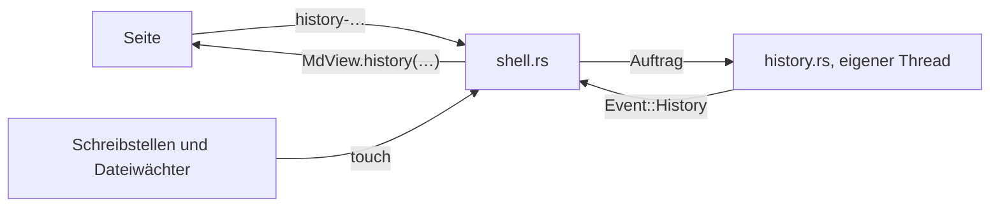

# Git-Phase 1: Lokale Historie

Umsetzungsplan für die erste von drei Phasen (lokale Historie → GitHub-Verknüpfung → Web-App).
Phase 1 kommt ohne Netz und ohne Anmeldung aus: Ein Ordner wird zum Projekt, die App schreibt im
Hintergrund Schnappschüsse, und pro Datei gibt es Verlauf, Differenz und Wiederherstellen.

> [!success] Stand
> Phase 1 ist gebaut, alle sechs Schritte, dazu das Ausschalten: `src-tauri/src/history.rs`
> (13 Tests mit `cargo test`), die Anbindung in `shell.rs`, die Uhr in der Seitenleiste, die
> Übersicht in den Einstellungen, das Verlaufsfenster und die Verschachtelung
> (`dev/rig.sh history`, 39 Prüfungen). Nicht geprüft sind nur die beiden Systemdialoge
> (Repository übernehmen, Projekte zusammenführen). Weiter geht es in [[Git-Phase-2]].

## Was am Ende da ist

- Ein Ordner lässt sich bewusst als Projekt versionieren. Bloßes Öffnen legt nichts an.
- Änderungen werden nach einer ruhigen Phase als Commit festgehalten, mit Geräte-ID.
- Pro Notiz: Liste der Versionen, Differenz zu jeder Version, Wiederherstellen.
- Verschachtelung ist geregelt: Projekt darüber, Projekt darunter, fremdes Repository darüber
  (dort nur lesen, oder das ganze Repository übernehmen).
- Der Ordner ist ein normales Git-Repository. Phase 2 hängt nur noch ein Remote daran.

## Festlegungen

| Frage | Festlegung |
|---|---|
| Git-Anbindung | `git2` 0.21 mit eingebautem libgit2, ohne Netz-Features (die kommen in Phase 2) |
| Projekt-Marker | `.mdview/project.json` mit `id` (UUID), `created`, `version`; wird mitcommittet, damit ein Klon in Phase 2 als Projekt erkannt wird |
| Geräte-ID | `device: { id, name }` in `state.json`, einmal erzeugt; Name ist anfangs der Rechnername und in den Einstellungen änderbar |
| Commit-Takt | 30 s nach der letzten Änderung, beim Schließen des letzten Fensters eines Projekts, vor dem Beenden |
| Commit-Nachricht | Betreff aus den geänderten Dateien, auf Englisch (`Notiz.md` oder `4 files: A.md, B.md, C.md, …`; der erste Commit heißt `History switched on`), dazu die Trailer `Device:` und `Client:` |
| Autor | Name und Adresse aus der globalen Git-Konfiguration, sonst der Gerätename; Phase 2 ersetzt das durch die GitHub-Identität |
| Differenz | Wird in der Seite gerechnet (JavaScript), nicht in Rust: Die Hülle liefert nur zwei Texte. So nutzt die Web-App in Phase 3 dieselbe Ansicht |
| Wiederherstellen | Schreibt den alten Inhalt als neue Version. Die Historie wird nie umgeschrieben |
| Einschalten | Bewusst, pro Ordner. Bloßes Öffnen legt nichts an |
| Was ein Projekt ist | Markerdatei und `.git` im selben Ordner. Ein Repository ohne Markerdatei ist fremd; dort committet die App nie |
| mdview-Projekt im Überordner | Der Ordner wird ohne Nachfrage dort mitversioniert |
| Fremdes Repository im Überordner | Keine Versionierung durch die App; der Verlauf ist nur zum Lesen da. Das ganze Repository lässt sich bewusst als Projekt übernehmen |
| Ort des Verlaufs | Ein Dialog (vorerst) |

## Aufbau im Code

Ein neues Modul `src-tauri/src/history.rs`, gebaut wie `Completer` in `ai.rs`: ein eigener Thread,
der Aufträge annimmt und über `Event` antwortet. Git-Arbeit läuft damit nie im Thread der
Fensterlogik.

**Neu**

- `src-tauri/src/history.rs`: Projekterkennung, Schnappschuss, Verlauf, Inhalt einer Version,
  Zusammenführen von Unterprojekten.
- `active/history.js` und Regeln in `active.css`: Verlaufsliste und Differenzansicht.
- `vendor/diff.min.js`: das npm-Paket `diff`, gebündelt über `dev/build-vendor.mjs` wie ProseMirror.
- `dev/probe-history.js` und `dev/rig.sh history`.

**Geändert**

- `main.rs`: `Event::Snapshot { root, turn }` und `Event::History { label, … }`.
- `shell.rs`:
  - `App` bekommt den `Historian` und pro Projekt einen `turn`-Zähler für die Entprellung
    (dasselbe Muster wie `rescan_turn`). Einen Cache „Ordner → Projekt" gibt es nicht: Die
    Suche nach oben kostet nur ein paar Dateiabfragen.
  - `App::touch(path)`: sucht das Projekt zum Pfad und setzt `after(30_000, Event::Snapshot)`.
  - Aufrufe von `touch` bei jeder Meldung des Dateiwächters (deckt auch fremde Editoren ab),
    bei jeder schreibenden Nachricht der Seite (`save`, `toggle`, `pasteimage`, `dropfiles`,
    `graphic-save`, `newnote`, `newfolder`, `rename`, `trash`) und beim Öffnen einer Notiz oder
    eines Ordners. Das Letzte holt nach, was sich geändert hat, während die App nicht lief.
  - Geht ein Fenster, werden die offenen Schnappschüsse der Projekte geschrieben, die kein
    Fenster mehr zeigt; vor `handle.exit(0)` und vor dem Neustart nach einem Update wird auf
    den Historian gewartet.
  - `send_folder`: der Zustand des Ordners geht mit an die Seite
    (`history: { state, root, name }`, mit `state` = `none | project | inside | foreign`; `foreign`: nur lesen).
  - `on_message`: die Nachrichten unten.
  - `default_prefs`: `historyQuiet` (Sekunden, Vorgabe 30).
- `scan.rs` bleibt, wie es ist: Versteckte Einträge werden schon übersprungen, `.git` und `.mdview`
  tauchen also weder in der Seitenleiste noch im Dateiwächter auf.

**Nachrichten**

| Von der Seite | Antwort |
|---|---|
| `history-enable { root, how }` | `how` = `new` oder `adopt` (ein fremdes Repository übernehmen); neuer Ordnerzustand über `setFolder` |
| `history-log { path }` | `MdView.history({ path, versions: [{ id, time, device, subject }] })` |
| `history-text { path, id }` | `MdView.historyText({ path, id, text })` |
| `history-restore { path, id }` | die Datei wird geschrieben; der Wächter lädt sie wie jede fremde Änderung neu |
| `history-nested { root, child, how }` | `how` = `merge` oder `separate`; danach neuer Ordnerzustand |

## Schritte

Jeder Schritt ist für sich lauffähig und prüfbar.

### 1. Repository und Schnappschuss, ohne Oberfläche

- `git2` mit `default-features = false, features = ["vendored-libgit2"]` einbinden; Build auf
  diesem Rechner bestätigt. Das Programm wächst von 13,1 auf 14,1 MB.
- `history.rs`: `project_of(path)`, `enable(root)`, `snapshot(root)`, `log(path)`, `text(path, id)`.
- `snapshot`: alles Neue und Geänderte in den Index, Baum mit dem des letzten Commits vergleichen,
  bei Gleichheit kein Commit.
- Beim Einschalten wird eine `.gitignore` nur angelegt, wenn keine da ist (`.DS_Store`, `Thumbs.db`).
- Dateien über 50 MB bleiben draußen und werden einmal gemeldet (GitHub lehnt später ab 100 MB ab).
- Prüfung: `cargo test` mit Temp-Ordnern. Das sind die ersten Rust-Tests im Projekt.

### 2. Anbindung an die Hülle

- `touch`, die Entprellung, das Schreiben beim Schließen und Beenden.
- Geräte-ID erzeugen und in die Trailer schreiben.
- Zum Testen lässt sich die Ruhezeit über `MDVIEW_HISTORY_QUIET_MS` verkürzen.
- Prüfung: `dev/rig.sh history` — Commit nach Ruhezeit, nach einer Änderung von außen und beim
  Schließen; jeder nennt Gerät und Programm.

### 3. Einschalten in der Oberfläche

- Eine Uhr im Kopf der Seitenleiste, gedimmt, solange die App hier keinen Verlauf führt. Ihr
  Menü bietet an, was an der Stelle geht, oder sagt, was gilt: „Turn On History", „Use This
  Repository for History…", „History Is On", „Part of the Project …", „Kept by the Repository …".
- Ein vorhandenes Repository wird erst nach einer Rückfrage übernommen (Systemdialog); sie nennt
  den Branch, auf dem die Commits landen.
- Eine Seite „Verlauf" in den Einstellungen. Oben die Übersicht über den Ordner des Fensters:
  an oder aus (mit Knopf zum Einschalten), Name und Ort des Repositorys, Branch, Zahl der
  Versionen, letzte Version mit Zeit und Gerät, und was noch nicht festgehalten ist. Sie
  aktualisiert sich nach jedem Commit. Darunter Ruhezeit (`historyQuiet`), Gerätename
  (`deviceName`; leer ist es der Rechnername) und Geräte-ID.
- Prüfung: `dev/rig.sh history` schaltet über die Uhr ein. Die Zustände „im Projekt",
  „Repository hier" und „im fremden Repository" sind von Hand im Rig angesehen; die Rückfrage
  beim Übernehmen ist nicht geprüft.

### 4. Verlauf und Differenz

- Das Verlaufsfenster (`active/history.js`) ist gebaut wie das Einstellungsfenster und aus
  denselben Teilen: links die Versionen der gezeigten Notiz mit Zeit und Gerät, rechts die
  Differenz. Es öffnet über das Menü der Uhr („Show History of This Note") oder
  <kbd>Ctrl</kbd>+<kbd>Alt</kbd>+<kbd>H</kbd>; das Zweite geht auch in einem Fenster ohne Seitenleiste.
- Verglichen wird wahlweise mit der Version davor („What this version changed", die Vorgabe)
  oder mit der Notiz, wie sie jetzt ist („Difference to the note now").
- Differenz im Quelltext, zeilenweise, mit Hervorhebung der geänderten Wörter; unveränderte
  Zeilen werden bis auf drei um jede Änderung gezählt statt gezeigt. Gerechnet wird in der Seite
  (`vendor/diff.min.js`, das npm-Paket `diff` 9.0.0). Eine Differenz in der gerenderten Ansicht
  ist nicht Teil von Phase 1.
- „Restore This Version" schreibt den alten Inhalt als Datei; der Dateiwächter lädt ihn wie jede
  Änderung von außen, und der nächste Schnappschuss hält ihn als neue Version fest.
- Umbenannte Notizen: Kam die Datei durch Umbenennen zu ihrem Namen, geht der Verlauf unter dem
  alten Namen weiter (jede Version trägt ihren Pfad im Repository).
- Die Versionen liest die Hülle im Thread der Fensterlogik, nicht im Historian: Für eine Datei
  sind das wenige Millisekunden. Wird das bei sehr langen Historien spürbar, wandert es um.
- In einem fremden Repository zeigt das Fenster dessen Historie; Wiederherstellen schreibt dort
  nur die Datei.

### 5. Verschachtelung

Beim Einschalten und beim Öffnen eines Ordners sucht die App nach oben und nach unten.

| Lage | Verhalten |
|---|---|
| mdview-Projekt darüber | Der Ordner gehört dazu. Kein neues Repository; der Verlauf zeigt nur seine Dateien |
| mdview-Projekt darunter | Einmalige Frage: zusammenführen oder getrennt lassen |
| nur fremdes `.git` darüber | Die App schreibt nichts. Der Verlauf zeigt die vorhandene Historie zum Lesen; „Einschalten" gibt es für den Ordner nicht |

**Die Frage** kommt als Systemdialog, wenn ein Ordner eingeschaltet wird, in dem schon Projekte
liegen: „Take In", „Leave Separate" oder abbrechen. Sie gilt für alle gefundenen Projekte
zusammen. Gesucht wird wie beim Ordner-Scan (keine versteckten Ordner, höchstens 12 Ebenen) und
nicht innerhalb eines anderen Repositorys.

**Zusammenführen** läuft in dieser Reihenfolge:

1. Offene Änderungen im Unterprojekt und im Überprojekt als Commits schreiben.
2. Alle Objekte des Unterprojekts in das Repository des Überprojekts kopieren.
3. Einen Merge-Commit mit zwei Vorgängern schreiben: der Baum des Überprojekts, darin der Baum
   des Unterprojekts unter seinem Pfad, ohne dessen `.mdview`.
4. Das `.git` des Unterprojekts nach `<Überprojekt>/.git/mdview-absorbed/<pfad>-<zeit>`
   verschieben (30 Tage aufgehoben, dann beim nächsten Schnappschuss gelöscht), sein `.mdview`
   entfernen.

Der Verlauf einer Notiz folgt jeweils einer Linie von Commits und wechselt nur dort in eine
zugeführte Linie, wo die Datei von dort kam. So reicht er durch das Zusammenführen bis zum
ersten Commit im Unterprojekt, und eine gleichnamige Datei im anderen Projekt wird nicht
verwechselt. Ein reines Umbenennen oder Verschieben zählt nicht als Version.

**Getrennt lassen** braucht keinen Eintrag: Jeder Schnappschuss lässt alles aus, was unter einem
anderen Repository im Projekt liegt, ob eigenes Projekt oder fremdes Repository. Dasselbe gilt
für die Zahl „Noch nicht festgehalten".

**Fremdes Repository darüber:** Die App committet dort nicht und legt keine Markerdatei an.
`history-log` und `history-text` lesen aus dem fremden Repository, die Verlaufsansicht ist
dieselbe, nur ohne „Wiederherstellen" als Commit: Wiederherstellen schreibt die Datei, den Commit
macht, wer das Repository verwaltet.

**Übernehmen:** Ist das fremde Repository in Wahrheit ein Notiz-Ordner (von Hand angelegt oder
geklont), lässt es sich als Projekt übernehmen. Die App legt dann `.mdview/project.json` an der
Wurzel des Repositorys an; ab da ist es ein normales Projekt. Übernommen wird immer das ganze
Repository, nie ein Unterordner davon. Ein eigenes Projekt mitten in einem fremden Repository
gibt es in Phase 1 nicht.

Prüfung: Die Lagen und das Zusammenführen als `cargo test`, darunter der Verlauf einer Notiz
durch das Zusammenführen bis zu ihrem ersten Commit; `dev/rig.sh history` führt über die App
zusammen. Die beiden Systemdialoge (Übernehmen, Zusammenführen) sind nicht geprüft.

### 6. Abschluss

- `dev/rig.sh history`: einschalten über die Uhr, Commits nach Ruhezeit, von außen und beim
  Schließen, das Verlaufsfenster mit Differenz und Wiederherstellen, ein Projekt aufnehmen.
- Abschnitt „History" in `docs/FEATURES.md`, dazu die Taste und die Einstellungsseite; Texte in
  `strings.js` (englisch und deutsch). Die Texte der Seitenleiste und der Systemdialoge sind
  englisch und stehen wie die übrigen dort im Code.
- Gemessen in einem Ordner mit 5000 Notizen (je rund 3 KB) und 500 Commits, Release-Build, auf
  diesem Rechner, Dateien auf `tmpfs`:

| Was | Dauer |
|---|---|
| Erster Schnappschuss, 5000 Notizen | 386 ms |
| Schnappschuss, nichts geändert | 33 ms |
| Schnappschuss, eine Notiz geändert | 34 ms |
| Übersicht für die Einstellungen | 14 ms |
| 500 Versionen einer Notiz auflisten | 19 ms |
| Versionen einer Notiz mit zwei Versionen | 9 ms |
| Text einer Version | 0,1 ms |

  Die Schnappschüsse laufen im Thread des Historian, Übersicht und Versionsliste im Thread der
  Fensterlogik. Wiederholen: `cargo test --release measure -- --ignored --nocapture`.

### Nachtrag: Ausschalten

- „Turn Off History" im Menü der Uhr und in den Einstellungen. Was noch wartet, wird zuerst
  festgehalten; dann geht nur die Markerdatei. Das Repository bleibt mit allen Versionen, der
  Verlauf lässt sich weiter lesen, geschrieben wird nichts mehr.
- Wieder einschalten stellt die Markerdatei aus dem letzten Commit her: Es ist dasselbe Projekt
  mit derselben ID, und es kommt keine Rückfrage wie bei einem fremden Repository.
- Das Verlaufsfenster speichert beim Öffnen, was getippt und noch nicht gespeichert ist. So wird
  mit der Notiz auf der Platte verglichen, und eine wiederhergestellte Version wird nicht von
  einem ausstehenden Speichern überschrieben.
- Vor dem automatischen Beenden ohne Fenster ist geprüft, dass der letzte Commit geschrieben ist
  (`MDVIEW_RESIDENT_MS` verkürzt die Wartezeit für den Test).

## Risiken

- **Build auf anderen Systemen:** libgit2 wird mitkompiliert (das Programm wächst von 13,1 auf
  14,2 MB). Windows und macOS sind für die App insgesamt noch nie gebaut worden.
- **Große Ordner:** Der Schnappschuss prüft jedes Mal den ganzen Ordner. Bei 5000 Notizen sind
  das 33 ms im Hintergrund; auf einer langsamen Platte oder bei viel mehr Dateien wäre der
  nächste Schritt, nur die berührten Pfade zu prüfen.
- **Übernommene Repositories:** Nach dem Übernehmen committet die App automatisch auf dem Branch,
  der gerade ausgecheckt ist. Der Dialog zum Übernehmen sagt das ausdrücklich.
- **Sehr viele Commits:** Bei 30 s Ruhezeit entstehen an einem Schreibtag leicht hundert Commits.
  Für Git ist das unkritisch. Die Verlaufsliste zeigt sie einzeln; ein Zusammenfassen nach Tagen
  gibt es noch nicht.
- **Hart beendet:** Wird die App abgeschossen, fehlt der letzte Commit. Er wird nachgeholt,
  sobald im Projekt wieder eine Notiz oder der Ordner geöffnet wird.
