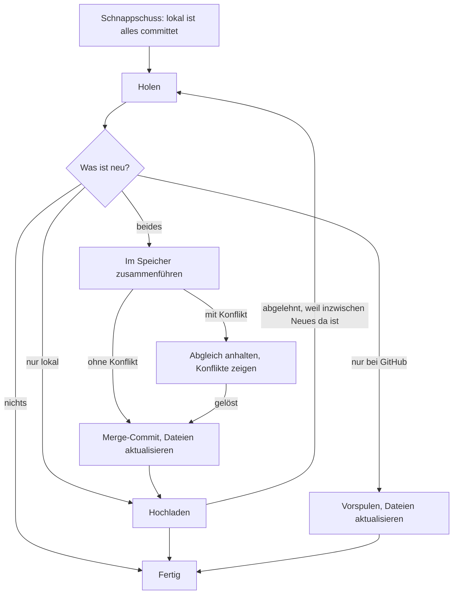

# Git-Phase 2: Verknüpfung mit GitHub

Umsetzungsplan für die zweite von drei Phasen. [[Git-Phase-1]] hat aus einem Ordner ein Projekt
mit lokaler Historie gemacht. Phase 2 hängt ein GitHub-Repository daran: anmelden, verknüpfen,
im Hintergrund abgleichen, Konflikte lösen. GitHub ist danach die Quelle der Wahrheit; ohne
Verknüpfung läuft alles wie bisher.

> [!important] Stand
> Die Schritte 1 bis 3 sind gebaut: `src-tauri/src/sync.rs` holt, lädt hoch, gleicht ab und löst
> Konflikte (10 Tests gegen ein nacktes Repository, 1 gegen das echte GitHub), dazu das
> Konfliktfenster (`dev/rig.sh sync`, 25 Prüfungen). Verknüpfen lässt sich ein Projekt bisher
> nur über die Nachricht `history-link`, und ohne Anmeldung nur mit einem Repository auf
> demselben Rechner. Die GitHub App ist registriert und installiert, das Test-Repository ist
> `md-view-test-notes`. Die Schritte 4 bis 6 sind Plan.

## Was am Ende da ist

- In der App mit GitHub anmelden, ohne Passwort oder Token einzutippen.
- Ein Projekt mit einem Repository verknüpfen, oder ein Repository als neues Projekt holen.
- Abgleich im Hintergrund: Jeder Commit geht zu GitHub, was dort neu ist, kommt herunter.
- Haben zwei Geräte dieselbe Notiz geändert, wird zusammengeführt. Wo das nicht von selbst
  geht, zeigt die App beide Fassungen mit Differenz und lässt wählen.
- Der Zustand ist sichtbar: an der Uhr und in den Einstellungen.

## Was die GitHub-Doku sagt

| Punkt | Befund |
|---|---|
| Anmeldung am Desktop | Device Flow: Die App zeigt einen Code, der Browser öffnet `github.com/login/device`. Dafür genügt die Client-ID; ein Client-Secret braucht es nicht. In den Einstellungen der GitHub App muss „Enable Device Flow" an sein |
| Token | Zugriffstoken (`ghu_…`) gilt 8 Stunden, Auffrischtoken (`ghr_…`) 6 Monate, wenn „Expire user authorization tokens" an ist (empfohlen) |
| Was das Token darf | Nur, was Nutzer **und** App dürfen, und nur in Repositories, für die die App installiert ist |
| Installieren ist ein eigener Schritt | Anmelden allein gibt keinen Zugriff. Die App muss auf dem Konto installiert sein, mit „allen" oder ausgewählten Repositories. `GET /user/installations` und `GET /user/installations/{id}/repositories` sagen, was freigegeben ist |
| Rechte zum Abgleichen | Repository-Berechtigung „Contents: Read & write" (Metadata: Read kommt von selbst dazu) |
| Repository aus der App anlegen | Nicht eindeutig: Die Berechtigungsliste führt `POST /user/repos` für Nutzer-Token auf, die Liste der für Nutzer-Token verfügbaren Endpunkte zeigte ihn mir nicht. Wird in Schritt 4 am echten Konto geprüft |

## Festlegungen

| Frage | Festlegung |
|---|---|
| Transport | libgit2 über HTTPS (`git2` mit dem Feature `https`). Das Token wird nur im Speicher an libgit2 gereicht, nie in die Git-Konfiguration oder in eine URL geschrieben |
| Token-Ablage | Das Auffrischtoken im System-Schlüsselbund (Crate `keyring`; auf Linux der Secret Service). Das Zugriffstoken bleibt im Speicher und wird bei Bedarf erneuert |
| Wer committet | Name und `id+login@users.noreply.github.com` aus `GET /user`. Die Trailer `Device:` und `Client:` bleiben |
| Zusammenführen | Merge, nie Rebase und nie Force-Push: Commits mit Geräte-ID werden nicht umgeschrieben |
| Branch | Nur der Standard-Branch des Repositorys |
| Wann abgeglichen wird | Nach jedem Schnappschuss (hoch), beim Start, wenn ein Fenster den Fokus bekommt und alle 60 s bei offenem Fenster (herunter) |
| Ohne Netz | Still weitermachen und später wieder versuchen. Lokale Commits sammeln sich und gehen beim nächsten Erfolg hoch |
| Verknüpfen | Projekt → leeres Repository: hochladen. Repository → neuer Ordner: holen. Haben beide Seiten schon Historie, wird in Phase 2 abgelehnt |

## Ablauf eines Abgleichs

- **Zusammenführen im Speicher:** libgit2 rechnet den Merge, ohne Dateien anzufassen. In den
  Notizen landen nie Konfliktmarker. Solange ein Konflikt offen ist, arbeitet man lokal weiter;
  nur der Abgleich wartet.
- **Dateien aktualisieren:** Kommt Neues herunter, schreibt die App die geänderten Dateien. Der
  Dateiwächter lädt eine offene Notiz neu, wie bei jeder Änderung von außen. Vorher wird
  gespeichert und festgehalten, was noch offen ist.
- **Der Verlauf** folgt schon jetzt einer Linie von Commits und wechselt in eine zugeführte,
  wo die Datei von dort kam. Für Merges von anderen Geräten ist er damit vorbereitet.

## Konflikte

Ein Konflikt ist eine Datei, die auf beiden Seiten an derselben Stelle anders ist.

- **Text:** ein Fenster wie das Verlaufsfenster. Links die Dateien mit Konflikt, rechts die
  Stellen: „meine Fassung", „ihre Fassung", jeweils mit Gerät und Zeit, und die Wahl je Stelle:
  meine, ihre, beide untereinander. Die Vorschau zeigt, was herauskommt.
- **Bilder, PDFs, alles Nicht-Text:** eine der beiden Fassungen, oder beide behalten (die
  zweite unter einem Namen mit dem Gerät darin).
- **Gelöscht gegen geändert, umbenannt gegen geändert:** behalten oder löschen, mit Anzeige der
  geänderten Fassung.
- Erst wenn jede Datei entschieden ist, entsteht der Merge-Commit und der Abgleich läuft weiter.

`active/markdown.js` enthält schon ein Zusammenführen dreier Fassungen auf Blockebene (für den
aktiven Modus). Ob sich damit mehr Fälle von selbst lösen lassen als mit Gits zeilenweisem
Merge, wird in Schritt 3 ausprobiert, nicht vorausgesetzt.

## Schritte

Jeder Schritt ist für sich prüfbar. Die Schritte 1 bis 3 brauchen kein GitHub: Als Gegenstelle
dient ein nacktes Repository in einem Temp-Ordner.

### 1. Netz in der Git-Anbindung

- `git2` mit `https` gebaut, gegen das OpenSSL des Systems (3.6). Das Programm wächst von 14,18
  auf 14,24 MB; ein Release-Build dauert rund 40 s.
- `sync.rs`: `link`, `linked`, `branches`, `fetch`, `push`. Zugangsdaten als Rückruf mit dem
  Nutzernamen `x-access-token`; wird das Token nicht angenommen, endet der Versuch mit einer
  Meldung statt in einer Schleife.
- `push` lädt nur hoch, was an das anschließt, was drüben ist. Hat die andere Seite Commits,
  die hier fehlen, wird abgelehnt.
- Prüfung: `cargo test` gegen ein nacktes Repository (hochladen, auf einem zweiten „Gerät"
  holen, abgelehntes Hochladen, ohne Verknüpfung). Dazu auf Anforderung gegen GitHub:
  `cargo test --release network -- --ignored` liest die Branches eines öffentlichen Repositorys
  und bekommt für eine Adresse ohne Zugriff eine Absage.
- Dabei aufgefallen: Ein frisch geholtes Repository ist nur dann sofort ein Projekt, wenn der
  richtige Branch ausgecheckt wird. Beim Holen in Schritt 5 wird der Standard-Branch des
  Repositorys ausdrücklich gewählt.

### 2. Der Abgleich

- `sync::reconcile`: festhalten, holen, dann hochladen, vorspulen oder zusammenführen. Das
  Ergebnis ist einer von acht Zuständen (gleich, hochgeladen, heruntergeladen, zusammengeführt,
  Konflikt, nicht erreichbar, Anmeldung nötig, abgelehnt).
- Zusammengeführt wird im Speicher. Der Ordner wird erst geändert, wenn feststeht, dass es
  geht, und nur, solange er noch dem letzten Commit entspricht: Eine seither geänderte Datei
  wird nie überschrieben; dann passiert nichts und es wird beim nächsten Mal wieder versucht.
- Bei einem Konflikt wird nichts angefasst: keine Marker in den Notizen, nichts hochgeladen.
  Lokal wird weiter festgehalten.
- Ein Repository ohne gemeinsamen Commit gilt als anderes Projekt und wird abgelehnt.
- Anbindung: Der Historian gleicht nach jedem Schnappschuss eines verknüpften Projekts ab, dazu
  alle 60 s die Projekte, die ein Fenster zeigt (`MDVIEW_SYNC_MS` für Tests). Ein Projekt, in
  dem noch Änderungen auf ihren Schnappschuss warten, wird vom Zeitgeber übersprungen: In einen
  Ordner, in dem gerade geschrieben wird, kommt nichts herunter. Ein eigener Auslöser beim
  Fokus fehlt noch; der Zeitgeber deckt das binnen einer Minute.
- Der Zustand geht mit `setFolder` und `settings-info` an die Seite (`history.linked`,
  `history.sync`); angezeigt wird er erst in Schritt 5.
- Der Verlauf einer Notiz folgt jetzt jeder Linie, durch die ihre Geschichte läuft: Nach einem
  Zusammenführen stehen die Versionen beider Geräte in der Liste.
- Prüfung: `cargo test` mit zwei „Geräten" (ein Gerät hält fest, das andere bekommt es; beide
  ändern Verschiedenes; beide ändern dieselbe Stelle; Gegenstelle weg; fremdes Projekt).
  `dev/rig.sh sync` verknüpft in der App, spielt das zweite Gerät mit `git` und prüft Hochladen,
  Herunterladen bis auf die Seite und das Zusammenführen.

### 3. Konflikte

- `sync::conflicts` rechnet den Merge im Speicher und liefert je Datei, was zu entscheiden ist.
  Eine Notiz kommt in Teilen: was beide gleich haben oder nur einer geändert hat, ist schon
  zusammengeführt; jede Stelle, die beide geändert haben, trägt „meine", „ihre" und die
  gemeinsame Fassung davor. Alles andere (kein Text, über 2 MB, auf einer Seite gelöscht) wird
  als ganze Datei entschieden.
- `sync::resolve` führt mit den Entscheidungen zusammen: für eine Notiz der fertige Text, für
  eine Datei „meine", „ihre" oder „beide" (die andere dann daneben als `Name (Gerät).ext`).
  Fehlt eine Entscheidung oder hat sich die Gegenstelle seither bewegt, passiert nichts.
- Das Konfliktfenster (`active/conflict.js`) teilt sich den Rahmen mit dem Verlaufsfenster:
  links die Dateien mit der Zahl offener Stellen, rechts je Stelle beide Fassungen mit Gerät
  und Zeit, die abweichenden Wörter markiert, und die Wahl „Mine", „Theirs", „Both". „Join"
  wird frei, sobald alles gewählt ist.
- Ein Konflikt meldet sich mit einer Einblendung; die Uhr wird rot und ihr Tooltip sagt es,
  ihr Menü hat „Resolve Conflicts…". Solange er offen ist, bleibt der Ordner, wie er hier
  geschrieben wurde, und die Gegenstelle unberührt.
- Nicht gebaut: das Zusammenführen auf Blockebene mit `active/markdown.js`. Gits zeilenweiser
  Merge löst die Fälle im Test; ob sich mehr lohnt, zeigt der Gebrauch.
- Prüfung: `cargo test` (Konflikt Stelle für Stelle, gelöst und hochgeladen, Bild auf beiden
  Seiten, gelöscht gegen geändert, unvollständige und veraltete Entscheidungen);
  `dev/rig.sh sync` erzeugt einen echten Konflikt und löst ihn über das Fenster.

### 4. Anmeldung

- Device Flow über `ureq`: Code anzeigen, Browser öffnen, abfragen, Token ablegen, erneuern.
- Einstellungen › History bekommt den Abschnitt „GitHub": angemeldet als …, abmelden.
- Braucht die Client-ID deiner GitHub App. Hier wird auch geprüft, ob das Anlegen eines
  Repositorys mit dem Nutzer-Token geht.
- Prüfung: von Hand gegen GitHub; der Ablauf selbst gegen eine Attrappe im Test.

### 5. Verknüpfen

- Liste der freigegebenen Repositories; fehlt das gewünschte, ein Verweis auf die Freigabe bei
  GitHub.
- „Mit Repository verknüpfen" für ein Projekt, „Von GitHub holen" für einen neuen Ordner,
  „Verknüpfung lösen" (das Repository bei GitHub bleibt, lokal bleibt die Historie).
- Die Uhr und die Übersicht zeigen den Abgleich: abgeglichen, n Versionen voraus, ohne Netz,
  Konflikt.

### 6. Abschluss

- `dev/rig.sh sync` gegen ein nacktes Repository, Abschnitt in `docs/FEATURES.md`.
- Eine Liste zum Durchklicken gegen das echte GitHub mit zwei Geräten.

## Die GitHub App registrieren

Das läuft über dein Konto, deshalb machst du es selbst. Auf GitHub: Einstellungen (dein Profil) ›
Developer settings › GitHub Apps › New GitHub App.

| Feld | Eintrag |
|---|---|
| GitHub App name | frei, höchstens 34 Zeichen, auf ganz GitHub einmalig (etwa „Markdown Notes Sync") |
| Homepage URL | `https://github.com/henriSchulz/mdview` |
| Callback URL | vorerst dieselbe Adresse; die Web-App aus Phase 3 trägt hier später ihre eigene ein |
| Expire user authorization tokens | an |
| Request user authorization (OAuth) during installation | an |
| Enable Device Flow | **an** |
| Webhook › Active | aus |
| Repository permissions | Contents: Read and write |
| Where can this GitHub App be installed? | „Only on this account", solange nur du sie nutzt |

> [!success] Registriert am 5. Oktober 2026
> Die App gehört @henriSchulz, App-ID 5199570, **Client ID `Iv23liovowgVJASctV6s`**. Der Device
> Flow ist an: GitHub gibt für diese Client-ID einen Gerätecode aus. Gewählt sind „Contents: Read
> and write", „Only on this account", und „Administration" ist aus – die App legt also keine
> Repositories an.

Danach:

1. Auf der Seite der App die **Client ID** kopieren und mir geben. Sie ist nicht geheim und
   steht später im Programm. Ein Client-Secret erzeugst du erst für Phase 3.
2. Die App auf deinem Konto installieren („Install App") und die Repositories wählen, die sie
   sehen darf. Für den ersten Test genügt ein leeres privates Repository.

## Risiken

- **OpenSSL:** Das Feature `https` von `git2` bindet OpenSSL ein. Auf Linux ist es da; für
  Windows und macOS müsste es mitgebaut werden. Die App selbst spricht sonst über `rustls`.
- **Dateien aktualisieren bei offenem Editor:** Der heikelste Moment ist, wenn Neues
  herunterkommt, während getippt wird. Regel: erst speichern und festhalten, dann holen; tippt
  jemand gerade, wartet das Herunterladen einen Moment.
- **Auffrischtoken wechselt bei jedem Erneuern.** Geht das Ablegen schief, ist die Anmeldung
  weg und man meldet sich neu an. Daten gehen dabei nicht verloren.
- **Zwei Fenster, ein Projekt, ein Abgleich:** Der Abgleich gehört dem Projekt, nicht dem
  Fenster; er läuft im Historian, einer nach dem anderen.
- **Große Dateien:** GitHub lehnt Dateien über 100 MB ab. Die App lässt schon jetzt alles über
  50 MB aus dem Verlauf; solche Dateien werden also nicht abgeglichen.

## Offene Entscheidungen

1. **Repository aus der App anlegen?** Wenn ja, braucht die GitHub App eine weitere
   Berechtigung (und es muss sich in Schritt 4 als machbar erweisen). Wenn nein, legst du das
   Repository bei GitHub an und wählst es in der App.
2. **Wer darf die App benutzen?** „Only on this account" heißt: nur dein Konto. Sollen andere
   sie nutzen können, muss sie „Any account" sein; das lässt sich später umstellen.
3. **Beide Seiten haben schon Historie:** Der Plan lehnt das Verknüpfen dann ab. Die
   Alternative ist, beide Historien zusammenzuführen wie beim Aufnehmen eines Unterprojekts;
   das ist mehr Arbeit und mehr Raum für Überraschungen.
