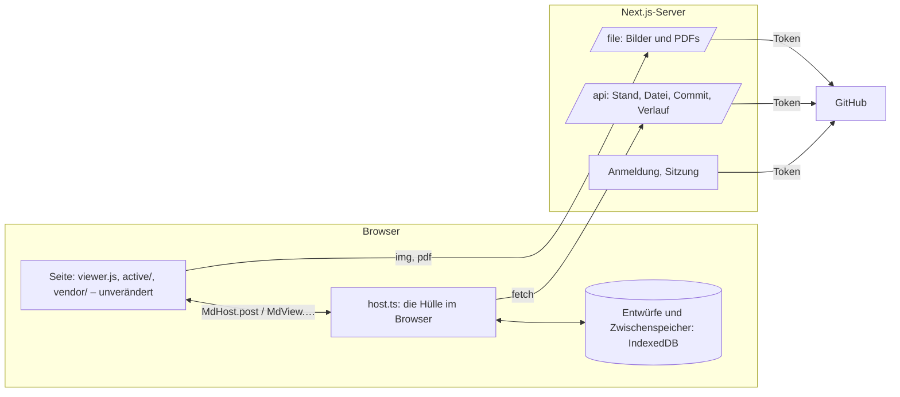

# Git-Phase 3: Die Web-App

Umsetzungsplan für die dritte Phase. Nach [[Git-Phase-1]] (lokale Historie) und [[Git-Phase-2]]
(Verknüpfung mit GitHub) kommt die Web-App: dieselben Notizen im Browser lesen und schreiben,
mit GitHub als einziger Quelle. Sie hat keinen eigenen Datenbestand und keine KI-Funktionen.

> [!important] Stand
> Das ist ein Plan, gebaut ist nichts. Am 6. Oktober 2026 entschieden: zuerst nur Lesen, und die
> App soll auf GitHub Pages liegen, gebaut aus diesem Repository. Das ändert den Aufbau unten
> („Auf GitHub Pages") und wirft zwei Fragen auf, die noch offen sind: wie Pages für dieses
> private Repository möglich wird, und wie man sich ohne Server anmeldet.

## Was am Ende da ist

- Eine Next.js-App. Ohne Anmeldung bei GitHub sieht man nur die Anmeldeseite.
- Nach der Anmeldung: die freigegebenen Repositories, eines öffnen, und darin dieselbe
  Oberfläche wie in der Desktop-App – Seitenleiste, Tabs, Lesen, aktiver Modus, Quelltext,
  PDFs, Suche, Alle Notizen.
- Änderungen werden als Commits bei GitHub festgehalten, mit Konto und Gerät.
- Was die Desktop-App oder ein anderer Browser schreibt, erscheint ohne Neuladen.
- Ändern zwei dieselbe Stelle, kommt dasselbe Konfliktfenster wie am Desktop.
- Der Verlauf einer Notiz, mit Differenz und Wiederherstellen.

## Die Lage im Code

Die Oberfläche ist schon jetzt von der Hülle getrennt. Sie spricht über genau eine Stelle:

| Richtung | Wie | Umfang |
|---|---|---|
| Seite → Hülle | `MdHost.post(JSON)` | 60 Nachrichten |
| Hülle → Seite | `MdView.…(…)` | 31 Aufrufe |
| Dateien neben einer Notiz | `<base href>` aus `render`, `MdHost.files` | zwei Adressen |
| Skripte und Styles | aus dem `src` des eigenen Skripts (`ASSETS`) | nichts zu tun |

Die Web-App ist damit eine zweite Hülle. Was die Rust-Hülle für die Seite tut, muss sie auch
tun – aber gegen GitHub statt gegen die Platte:

| Was die Hülle tut | Rust heute | Web |
|---|---|---|
| Ordner als Baum, Reihenfolge, Titel | `scan.rs` | aus dem Stand des Repositorys, im Browser |
| Notiz laden, Wikilinks auflösen, Rücklinks | `shell.rs`, `scan.rs` | neu in TypeScript |
| Tabs, Zurück und Vor, zuletzt geöffnet | `shell.rs` | neu in TypeScript; Zustand im Browser |
| Speichern, neu, umbenennen, löschen, Bild einfügen | `shell.rs` | Entwurf im Browser, dann Commit |
| Verlauf, Abgleich, Konflikte | `history.rs`, `sync.rs` | über die GitHub-API |
| Einstellungen, Thema, Bewegung | `shell.rs`, `theme.rs` | im Browser; Thema fest hell und dunkel |

Das ist der größte Posten der Phase: rund 2500 Zeilen Hüllenlogik, von denen die Web-App etwa
die Hälfte braucht.

**Was die Web-App nicht bekommt**

- KI: Vorschläge beim Tippen und gezeichnete Grafiken (`ghost.js`, `graphic.js`, die Seite
  „Writing Help" und ihre Nachrichten). So entschieden.
- Was nur ein Rechner hat: „Open With…", „Show in Finder", der Ordnerdialog, das Omarchy-Thema,
  die SF-Symbole (die gezeichneten Symbole sind als Ersatz schon da).
- Verlauf einschalten, verknüpfen, Projekte aufnehmen: Im Web ist jedes geöffnete Repository
  schon verknüpft.

## Was die GitHub-Doku sagt

| Punkt | Befund |
|---|---|
| Anmeldung im Web | Der Web-Ablauf derselben GitHub App: Weiterleitung zu GitHub und zurück, mit PKCE. Der Tausch des Codes gegen das Token braucht das **Client-Secret**, also einen Server. Die Rückkehradresse muss in der App als „Callback URL" eingetragen sein |
| Token | wie am Desktop: 8 Stunden, Auffrischtoken 6 Monate. Erneuern braucht hier ebenfalls das Client-Secret |
| Schreiben | GraphQL `createCommitOnBranch`: mehrere Dateien in einem Commit, mit `expectedHeadOid` – der Commit gelingt nur, wenn der Branch noch dort steht. Autor ist, wem das Token gehört; GitHub signiert den Commit, er gilt als „Verified" |
| Alles lesen | `GET …/git/trees/{sha}?recursive=1`: bis 100 000 Einträge und 7 MB, darüber `truncated` |
| Eine Datei lesen | Contents-API: bis 1 MB normal, bis 100 MB als Rohdaten, darüber nicht |
| Grenzen | 5000 Anfragen pro Stunde je Nutzer; höchstens 80 schreibende pro Minute und 500 pro Stunde |

## Aufbau

- **Das Token bleibt auf dem Server.** Es liegt verschlüsselt in einem Cookie, das Skripte nicht
  lesen können. Der Browser spricht nur mit der eigenen App, die App mit GitHub.
- **Die Hülle läuft im Browser** (`host.ts`). Sie hält den Stand des Repositorys im Speicher,
  beantwortet die Nachrichten der Seite und fragt den Server nur nach Daten.
- **Ein Stand auf einmal.** Beim Öffnen holt der Server den Baum und den Text aller Notizen zum
  aktuellen Commit und gibt ihn in Stücken an den Browser. Danach sind Titel, Wikilinks,
  Rücklinks, Vorschauen und Suche lokal wie am Desktop. Bilder und PDFs kommen einzeln, wenn
  sie gebraucht werden. Alles ist nach Commit und Blob benannt und bleibt im Browser liegen.
- **Die Seite selbst wird nicht kopiert.** `viewer.js`, `active/`, `vendor/` und die Styles
  kommen beim Bauen aus dem Checkout in die Web-App.

## Auf GitHub Pages

GitHub Pages liefert nur fertige Dateien aus. Es gibt dort keinen Server, auf dem ein Geheimnis
liegen oder ein Token getauscht werden könnte. Geprüft am 6. Oktober 2026:

| Punkt | Befund |
|---|---|
| Pages für dieses Repository | Abgelehnt: „Your current plan does not support GitHub Pages for this repository." Das Repository ist privat, und Pages aus einem privaten Repository gibt es erst ab GitHub Pro |
| Anmeldung mit GitHub aus dem Browser | Geht nicht. Die Adressen für den Gerätecode und den Token-Tausch erlauben keine Aufrufe von einer Webseite (kein CORS); der Web-Ablauf braucht ohnehin das Client-Secret |
| Lesen aus dem Browser | Geht. `api.github.com` erlaubt Aufrufe von jeder Webseite, mit einem Token |
| Next.js ohne Server | Geht als statischer Export (`output: "export"`), unter `https://henrischulz.github.io/mdview/` |

Daraus folgt für die Lese-Fassung:

- **Kein Server-Teil.** Die Kästen „Anmeldung, Sitzung", `/api` und `/file` aus dem Bild oben
  entfallen. Die Hülle im Browser spricht direkt mit `api.github.com`.
- **Das Token liegt im Browser**, nicht in einem Cookie des Servers. Bilder und PDFs holt die
  Hülle mit dem Token und reicht sie der Seite als lokale Adressen.
- **Die Seite selbst ist öffentlich**, wie alles auf Pages. Sie enthält keine Notizen: Die holt
  erst der Browser, mit dem Token, direkt bei GitHub.
- **Bauen und Ausliefern** übernimmt ein Workflow in `.github/workflows/`, bei jedem Push auf
  `main`.

## Schreiben

1. Die Seite speichert wie immer nach 800 ms („save"). Die Web-Hülle legt den Text sofort als
   Entwurf in den Browser; ein Neuladen oder Absturz verliert nichts.
2. Ein Commit folgt wie am Desktop: nach 30 s Ruhe, mit <kbd>Ctrl</kbd>+<kbd>S</kbd>, und wenn
   der Tab verlassen wird.
3. Der Commit nennt den Stand, auf dem er aufbaut (`expectedHeadOid`). Steht der Branch noch
   dort, ist er drin.
4. Steht er woanders, hat inzwischen jemand geschrieben. Die Hülle holt, was neu ist, und führt
   je Datei drei Fassungen zusammen: den alten Stand, den Entwurf, den neuen Stand. Geht das
   ohne Konflikt, wird der Commit auf dem neuen Stand wiederholt.
5. Geht es nicht, öffnet sich das Konfliktfenster aus Phase 2 (`active/conflict.js`). Die Hülle
   liefert ihm die Stellen im selben Format wie `sync.rs`.

Der Commit trägt die Trailer `Device:` und `Client: web …`. Die Geräte-ID entsteht einmal je
Browser. Weil der Entwurf vorher nie committet war, entsteht im Web kein Merge-Commit: Die
eigene Änderung kommt einfach hinter die fremde.

**Von außen:** Alle 60 s und beim Zurückkehren in den Tab fragt die Hülle, wo der Branch steht.
Hat er sich bewegt, holt sie die geänderten Dateien; eine offene Notiz ohne Entwurf wird neu
gezeigt, eine mit Entwurf beim nächsten Commit zusammengeführt.

## Festlegungen

| Frage | Festlegung |
|---|---|
| Wo die App liegt | Ordner `web/` in diesem Repository, mit eigenem `package.json`. Die Desktop-App braucht weiterhin kein Node |
| Next.js | Version 16, App Router |
| Anmeldung | Offen, siehe „Offene Entscheidungen". Mit einem Server: eigene, kleine Umsetzung aus zwei Routen und einem verschlüsselten Cookie, ohne Auth.js. Auf Pages: ein eingefügtes Token oder ein kleiner Dienst nur für die Anmeldung |
| Zugang | Ohne Anmeldung zeigt die App nur die Anmeldeseite |
| Was ein Projekt ist | Wie am Desktop: ein Repository mit `.mdview/project.json`. Eines ohne wird nur gelesen; „Use This Repository" schreibt die Markerdatei als Commit |
| Zustand des Nutzers | Tabs, zuletzt geöffnet, Einstellungen: im Browser, je Repository. Nichts davon auf dem Server |
| Zusammenführen dreier Fassungen | Im Browser, mit dem npm-Paket `node-diff3` |
| Thema | Hell und dunkel nach dem System, mit den Farben des Cupertino-Themas |

## Schritte

Jeder Schritt ist für sich lauffähig. Bis Schritt 3 wird nichts geschrieben.

### 1. Die Naht festschreiben

- Die 60 Nachrichten und 31 Aufrufe als TypeScript-Typen in `web/host/contract.ts`, jede
  markiert: übernehmen, neu bauen, entfällt.
- Das HTML-Gerüst der Seite (heute in `shell.rs` zusammengesetzt: CSP, Styles, Skriptliste) so
  herausziehen, dass beide Hüllen dieselbe Liste benutzen.
- Prüfung: Die Desktop-App läuft unverändert durch `dev/rig.sh`.

### 2. Gerüst und Anmeldung

- `web/` mit Next.js; Bauschritt, der die Seite aus dem Checkout holt.
- Anmeldung über den Web-Ablauf mit PKCE, Sitzung im Cookie, Erneuern des Tokens, Abmelden.
- Die Seite nach der Anmeldung: die freigegebenen Repositories, mit Suche, nichts vorausgewählt.
- Prüfung: Tests gegen ein GitHub-Double (das aus `dev/fake-github.py` wird dafür erweitert);
  von Hand gegen GitHub. Braucht von dir die Callback-URL und das Client-Secret, siehe unten.

### 3. Lesen

- Server: der Stand eines Commits in Stücken; `/file/…` für Bilder und PDFs.
- `host.ts`: Baum und Seitenleiste, Notiz laden, Wikilinks und Rücklinks, Tabs, Zurück und Vor,
  Alle Notizen, PDFs, Einstellungen ohne die Seiten, die es im Web nicht gibt.
- Prüfung: derselbe Testordner in Desktop und Web, die gerenderte Seite Notiz für Notiz
  verglichen (wie `dev/rig.sh compare`, mit Playwright statt des Rigs).

### 4. Schreiben

- Entwürfe im Browser; Commit nach Ruhezeit, mit <kbd>Ctrl</kbd>+<kbd>S</kbd>, beim Verlassen.
- Neue Notiz, Ordner, umbenennen, löschen, Bild einfügen und ablegen.
- Prüfung: Tests gegen das Double für jeden Fall; die Tipp-Probes des Rigs (`edit`, `native`,
  `m4`) laufen auch gegen die Web-Hülle.

### 5. Änderungen von außen und Konflikte

- Nachfragen nach dem Stand, Aktualisieren der offenen Notiz, Zusammenführen beim Commit.
- Das Konfliktfenster, gespeist von der Web-Hülle.
- Prüfung: zwei Browser gegen das Double; Desktop und Web gegen dasselbe Repository von Hand.

### 6. Verlauf und Abschluss

- Das Verlaufsfenster: Versionen einer Notiz über die Commits ihres Pfads, Text einer Version,
  Wiederherstellen als Commit.
- Veröffentlichen, Abschnitt in `docs/FEATURES.md`, eine Liste zum Durchklicken wie in Phase 2.

## Was du dafür tun musst

Erst für Schritt 2, und erst, wenn feststeht, wo die App läuft:

1. In den Einstellungen der GitHub App die **Callback URL** der Web-App eintragen, etwa
   `https://<deine-adresse>/auth/callback`. Für die Entwicklung zusätzlich
   `http://localhost:3000/auth/callback`.
2. Dort ein **Client-Secret** erzeugen. Es kommt als Umgebungsvariable auf den Server und in
   eine Datei `web/.env.local`, die nicht ins Repository geht. Mir musst du es nicht geben, wenn
   du es selbst dort einträgst.

## Risiken

- **Umfang der zweiten Hülle.** Jede Nachricht, die die Seite schickt, braucht im Web eine
  Antwort oder eine bewusste Lücke. Schritt 1 macht die Liste, damit nichts stillschweigend
  fehlt.
- **Zwei Hüllen, eine Seite.** Was künftig in `shell.rs` dazukommt, muss auch in `host.ts`
  dazukommen. Der Vergleich aus Schritt 3 bleibt als Prüfung stehen, damit das auffällt.
- **Große Repositories.** Der Stand kommt in Stücken, weil eine Antwort bei manchen Anbietern
  nur wenige MB groß sein darf. Ein Repository mit sehr vielen oder sehr großen Notizen lädt
  beim ersten Öffnen spürbar; danach liegt es im Browser.
- **Umbenennungen im Verlauf.** Die GitHub-API liefert die Commits eines Pfads, folgt aber
  keiner Umbenennung. Der Web-Verlauf endet dort, wo die Notiz ihren Namen bekam, anders als am
  Desktop.
- **Tab zu, bevor committet ist.** Der Entwurf liegt im Browser und wird beim nächsten Öffnen
  committet; bis dahin sieht ihn kein anderes Gerät.
- **Erneuern des Tokens bei mehreren Tabs.** Das Auffrischtoken wechselt bei jedem Gebrauch.
  Zwei Tabs, die gleichzeitig erneuern, würden sich gegenseitig abmelden; das Erneuern läuft
  deshalb über eine einzige Stelle im Server.

## Offene Entscheidungen

Entschieden ist: zuerst nur Lesen (Schritte 1 bis 3), und GitHub Pages aus diesem Repository.
Offen sind die zwei Fragen, die daraus entstehen.

### 1. Wie wird Pages möglich?

| Weg | Was es heißt |
|---|---|
| Repository öffentlich machen | Kostet nichts. Der ganze Quelltext und seine Historie werden für alle lesbar; vorher gehört die Historie auf Geheimnisse durchsucht |
| GitHub Pro | Rund 4 $ im Monat. Das Repository bleibt privat, Pages geht; die Seite selbst ist trotzdem öffentlich |
| Eigenes öffentliches Repository nur für die gebaute App | Kostet nichts, der Quelltext bleibt privat. Ein Workflow hier baut und schiebt das Ergebnis dorthin. Die Adresse wäre dann `henrischulz.github.io/<name>/`, nicht aus diesem Repository |

### 2. Wie meldet man sich an?

| Weg | Was es heißt |
|---|---|
| Zugriffstoken einfügen | Du erzeugst bei GitHub ein Token nur zum Lesen deiner Notiz-Repositories und fügst es einmal in die Web-App ein; es bleibt im Browser. Kein weiterer Anbieter, passt zu „nur Lesen". Es ist kein „Mit GitHub anmelden"-Knopf |
| Kleiner Dienst nur für die Anmeldung | Ein einzelner Funktionsaufruf bei einem anderen Anbieter (etwa Cloudflare Workers) tauscht den Code gegen das Token. Dann gibt es den Anmelde-Knopf, aber dein Client-Secret liegt dort |
| Doch ein Server statt Pages | Wie im ursprünglichen Aufbau oben, bei Vercel oder auf eigenem Rechner |

Für die Lese-Fassung passt das eingefügte Token am besten zu „vorerst auf GitHub". Spätestens
mit dem Schreiben (Schritt 4) lohnt die Frage noch einmal: Ein Token mit Schreibrecht im Browser
ist heikler als eines nur zum Lesen.

### 3. Nur für dich oder für andere?

Mit eingefügtem Token stellt sich die Frage nicht: Jeder bräuchte sein eigenes Token. Mit einem
Anmelde-Dienst müsste die GitHub App auf „Any account" umgestellt werden.
