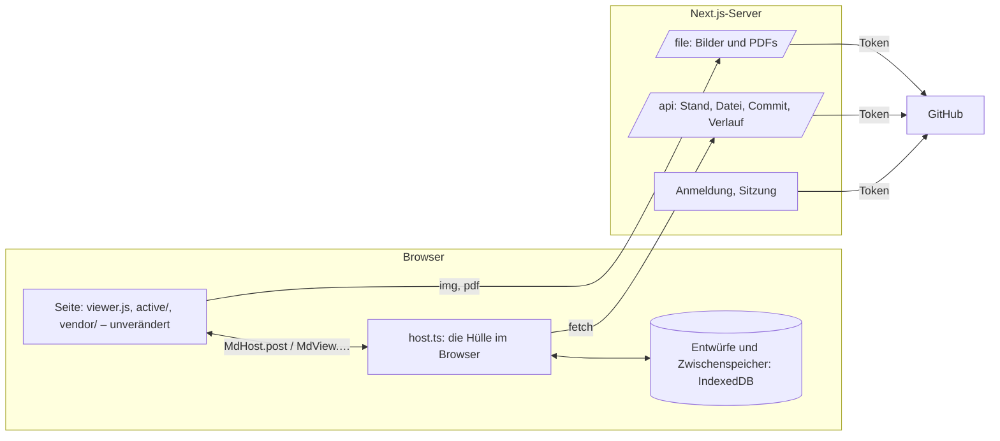

# Git-Phase 3: Die Web-App

Umsetzungsplan für die dritte Phase. Nach [[Git-Phase-1]] (lokale Historie) und [[Git-Phase-2]]
(Verknüpfung mit GitHub) kommt die Web-App: dieselben Notizen im Browser lesen und schreiben,
mit GitHub als einziger Quelle. Sie hat keinen eigenen Datenbestand und keine KI-Funktionen.

> [!important] Stand
> Alle sechs Schritte sind gebaut. Die App läuft als Next.js-App bei **Firebase App Hosting**,
> gebaut aus diesem Repository (öffentlich, MIT):
> <https://mdview--md-view.europe-west4.hosted.app>. Geprüft mit 39 Tests in `web/`, davon 21
> in einem echten Browser gegen ein GitHub-Double. Gegen das echte GitHub ist bisher nur die
> Anmeldung durchlaufen (5. Oktober 2026); Lesen, Schreiben und das Zusammenspiel mit der
> Desktop-App stehen aus: [[Git-Phase-3-Check]] ist die Liste zum Durchklicken.

## Was am Ende da ist

- Eine Next.js-App. Ohne Anmeldung bei GitHub sieht man nur die Anmeldeseite.
- Nach der Anmeldung: die freigegebenen Repositories, eines öffnen, und darin dieselbe
  Oberfläche wie in der Desktop-App – Seitenleiste, Tabs, Lesen, aktiver Modus, Quelltext,
  PDFs, Suche, Alle Notizen.
- Änderungen werden als Commits bei GitHub festgehalten, mit Konto und Gerät.
- Was die Desktop-App oder ein anderer Browser schreibt, erscheint ohne Neuladen.
- Ändern zwei dieselbe Stelle, kommt dasselbe Konfliktfenster wie am Desktop.
- Der Verlauf einer Notiz, mit Differenz und Wiederherstellen.

## Die Lage im Code

Die Oberfläche ist schon jetzt von der Hülle getrennt. Sie spricht über genau eine Stelle:

| Richtung | Wie | Umfang |
|---|---|---|
| Seite → Hülle | `MdHost.post(JSON)` | 64 Nachrichten |
| Hülle → Seite | `MdView.…(…)` | 29 Aufrufe |
| Dateien neben einer Notiz | `<base href>` aus `render`, `MdHost.files` | zwei Adressen |
| Skripte und Styles | aus dem `src` des eigenen Skripts (`ASSETS`) | nichts zu tun |

Die Web-App ist damit eine zweite Hülle. Was die Rust-Hülle für die Seite tut, muss sie auch
tun – aber gegen GitHub statt gegen die Platte:

| Was die Hülle tut | Rust heute | Web |
|---|---|---|
| Ordner als Baum, Reihenfolge, Titel | `scan.rs` | aus dem Stand des Repositorys, im Browser |
| Notiz laden, Wikilinks auflösen, Rücklinks | `shell.rs`, `scan.rs` | neu in TypeScript |
| Tabs, Zurück und Vor, zuletzt geöffnet | `shell.rs` | neu in TypeScript; Zustand im Browser |
| Speichern, neu, umbenennen, löschen, Bild einfügen | `shell.rs` | Entwurf im Browser, dann Commit |
| Verlauf, Abgleich, Konflikte | `history.rs`, `sync.rs` | über die GitHub-API |
| Einstellungen, Thema, Bewegung | `shell.rs`, `theme.rs` | im Browser; Thema fest hell und dunkel |

Das ist der größte Posten der Phase: rund 2500 Zeilen Hüllenlogik, von denen die Web-App etwa
die Hälfte braucht.

**Was die Web-App nicht bekommt**

- KI: Vorschläge beim Tippen und gezeichnete Grafiken (`ghost.js`, `graphic.js`, die Seite
  „Writing Help" und ihre Nachrichten). So entschieden.
- Was nur ein Rechner hat: „Open With…", „Show in Finder", der Ordnerdialog, das Omarchy-Thema,
  die SF-Symbole (die gezeichneten Symbole sind als Ersatz schon da).
- Verlauf einschalten, verknüpfen, Projekte aufnehmen: Im Web ist jedes geöffnete Repository
  schon verknüpft.

## Was die GitHub-Doku sagt

| Punkt | Befund |
|---|---|
| Anmeldung im Web | Der Web-Ablauf derselben GitHub App: Weiterleitung zu GitHub und zurück, mit PKCE. Der Tausch des Codes gegen das Token braucht das **Client-Secret**, also einen Server. Die Rückkehradresse muss in der App als „Callback URL" eingetragen sein |
| Token | wie am Desktop: 8 Stunden, Auffrischtoken 6 Monate. Erneuern braucht hier ebenfalls das Client-Secret |
| Schreiben | GraphQL `createCommitOnBranch`: mehrere Dateien in einem Commit, mit `expectedHeadOid` – der Commit gelingt nur, wenn der Branch noch dort steht. Autor ist, wem das Token gehört; GitHub signiert den Commit, er gilt als „Verified" |
| Alles lesen | `GET …/git/trees/{sha}?recursive=1`: bis 100 000 Einträge und 7 MB, darüber `truncated` |
| Eine Datei lesen | Contents-API: bis 1 MB normal, bis 100 MB als Rohdaten, darüber nicht |
| Grenzen | 5000 Anfragen pro Stunde je Nutzer; höchstens 80 schreibende pro Minute und 500 pro Stunde |

## Aufbau

- **Das Token bleibt auf dem Server.** Es liegt verschlüsselt in einem Cookie, das Skripte nicht
  lesen können. Der Browser spricht nur mit der eigenen App, die App mit GitHub.
- **Die Hülle läuft im Browser** (`host.ts`). Sie hält den Stand des Repositorys im Speicher,
  beantwortet die Nachrichten der Seite und fragt den Server nur nach Daten.
- **Ein Stand auf einmal.** Beim Öffnen holt der Server den Baum und den Text aller Notizen zum
  aktuellen Commit und gibt ihn in Stücken an den Browser. Danach sind Titel, Wikilinks,
  Rücklinks, Vorschauen und Suche lokal wie am Desktop. Bilder und PDFs kommen einzeln, wenn
  sie gebraucht werden. Alles ist nach Commit und Blob benannt und bleibt im Browser liegen.
- **Die Seite selbst wird nicht kopiert.** `viewer.js`, `active/`, `vendor/` und die Styles
  kommen beim Bauen aus dem Checkout in die Web-App.

## Bei Firebase App Hosting

Der Weg dorthin: Zuerst war GitHub Pages gewählt. Dort gibt es keinen Anmelde-Knopf, weil Pages
nur Dateien ausliefert und GitHubs Adressen für den Token-Tausch sich von einer Webseite nicht
aufrufen lassen (geprüft am 6. Oktober 2026). Firebase App Hosting führt die Next.js-App samt
Server-Teil aus; damit geht die Anmeldung so, wie sie oben gezeichnet ist.

| Punkt | Befund aus der Firebase-Doku |
|---|---|
| Tarif | nur im Bezahltarif (Blaze) |
| Next.js | ab 13.5 |
| Woher gebaut wird | aus einem verbundenen GitHub-Repository; jeder Push auf den Live-Branch (`main`) veröffentlicht von selbst |
| App in einem Unterordner | „App root directory", hier `/web` |
| Einstellungen | `web/apphosting.yaml`: Größe und Zahl der Instanzen, Umgebungsvariablen |
| Geheimnisse | `firebase apphosting:secrets:set NAME`; sie liegen in Googles Secret Manager, nicht im Repository |
| Adresse | `<backend>--<projekt>.<region>.hosted.app`; eine eigene Domain lässt sich später verbinden |

Daraus folgt:

- **Der Aufbau oben gilt:** Anmeldung und Sitzung auf dem Server, das Token in einem
  verschlüsselten Cookie, der Browser spricht nur mit der eigenen App.
- **Die Anmeldung hält**, solange das Auffrischtoken gilt (sechs Monate ohne Gebrauch): Der
  Server erneuert das Token selbst.
- **Kosten:** Die App läuft nur, wenn jemand sie aufruft (`minInstances: 0`). Der erste Aufruf
  nach einer Pause dauert dafür ein paar Sekunden.

## Schreiben

1. Die Seite speichert wie immer nach 800 ms („save"). Die Web-Hülle legt den Text sofort als
   Entwurf in den Browser; ein Neuladen oder Absturz verliert nichts.
2. Ein Commit folgt wie am Desktop: nach 30 s Ruhe, mit <kbd>Ctrl</kbd>+<kbd>S</kbd>, und wenn
   der Tab verlassen wird.
3. Der Commit nennt den Stand, auf dem er aufbaut (`expectedHeadOid`). Steht der Branch noch
   dort, ist er drin.
4. Steht er woanders, hat inzwischen jemand geschrieben. Die Hülle holt, was neu ist, und führt
   je Datei drei Fassungen zusammen: den alten Stand, den Entwurf, den neuen Stand. Geht das
   ohne Konflikt, wird der Commit auf dem neuen Stand wiederholt.
5. Geht es nicht, öffnet sich das Konfliktfenster aus Phase 2 (`active/conflict.js`). Die Hülle
   liefert ihm die Stellen im selben Format wie `sync.rs`.

Der Commit trägt die Trailer `Device:` und `Client: web …`. Die Geräte-ID entsteht einmal je
Browser. Weil der Entwurf vorher nie committet war, entsteht im Web kein Merge-Commit: Die
eigene Änderung kommt einfach hinter die fremde.

**Von außen:** Alle 60 s und beim Zurückkehren in den Tab fragt die Hülle, wo der Branch steht.
Hat er sich bewegt, holt sie die geänderten Dateien; eine offene Notiz ohne Entwurf wird neu
gezeigt, eine mit Entwurf beim nächsten Commit zusammengeführt.

## Festlegungen

| Frage | Festlegung |
|---|---|
| Wo die App liegt | Ordner `web/` in diesem Repository, mit eigenem `package.json`. Die Desktop-App braucht weiterhin kein Node |
| Next.js | Version 16, App Router |
| Anmeldung | Der Knopf „Mit GitHub anmelden": der Web-Ablauf derselben GitHub App mit PKCE, in zwei Routen der App (hin, zurück) und einem verschlüsselten Cookie. Kein Auth.js, kein Firebase Authentication |
| Zugang | Ohne Anmeldung zeigt die App nur die Anmeldeseite |
| Was ein Projekt ist | Wie am Desktop: ein Repository mit `.mdview/project.json`. Eines ohne wird nur gelesen; „Use This Repository" schreibt die Markerdatei als Commit |
| Zustand des Nutzers | Tabs, zuletzt geöffnet, Einstellungen: im Browser, je Repository. Nichts davon auf dem Server |
| Zusammenführen dreier Fassungen | Im Browser, mit dem npm-Paket `node-diff3` |
| Thema | Hell und dunkel nach dem System, mit den Farben des Cupertino-Themas |

## Schritte

Jeder Schritt ist für sich lauffähig. Bis Schritt 3 wird nichts geschrieben.

### 1. Die Naht festschreiben

- Die 64 Nachrichten und 29 Aufrufe stehen in `web/host/contract.ts`, jede mit dem, was die
  Web-Hülle damit tut: beantworten (23 und 15), schreiben (11 und 9, in der Lese-Fassung
  abgelehnt), im Browser erledigen (8 und 2), entfällt (22 und 3). Die Liste ist gegen
  `shell.rs` abgeglichen: nichts fehlt, nichts ist erfunden.
- Das HTML-Gerüst der Seite (heute in `shell.rs` zusammengesetzt: CSP, Styles, Skriptliste) so
  herausziehen, dass beide Hüllen dieselbe Liste benutzen.
- Prüfung: Die Desktop-App läuft unverändert durch `dev/rig.sh`.

### 2. Gerüst und Anmeldung

- `web/`: Next.js 16 mit dem App Router. `scripts/assets.mjs` holt die Seite der Desktop-App
  beim Bauen aus dem Checkout nach `public/app/`.
- Anmeldung in vier Routen unter `app/auth/`: hin zu GitHub (mit `state` und PKCE), zurück
  (Tausch des Codes mit dem Client-Secret), Erneuern, Abmelden. `proxy.ts` lässt ohne Sitzung
  nur die Anmeldeseite durch.
- Die Sitzung (`lib/session.ts`) liegt verschlüsselt in einem Cookie, das Skripte nicht lesen
  können; auf dem Server wird nichts gespeichert. Das Token wird fünf Minuten vor Ablauf
  erneuert, und zwar je Auffrischtoken nur einmal, auch wenn zwei Anfragen gleichzeitig kommen.
  Die Anmeldung hält damit, bis man sich abmeldet oder sechs Monate nicht da war.
- Nach der Anmeldung: die freigegebenen Repositories mit Suchfeld, nichts vorausgewählt.
- `apphosting.yaml`: eine Instanz, die schläft, wenn niemand da ist; die beiden Geheimnisse.
- Prüfung: `npm run build && npm test` in `web/` – 7 Tests spielen einen Browser gegen ein
  GitHub-Double: ohne Anmeldung nichts, hin und zurück, falsche Antworten, Ziel nach der
  Anmeldung (nie eine fremde Adresse), Erneuern auch bei zwei Anfragen zugleich, Abmelden, ein
  gefälschtes Cookie. Gegen das echte GitHub steht es aus.

### 3. Lesen

- Server (`web/app/api/r/…`, `web/app/file/…`): der Stand eines Repositorys (Commit des
  Standard-Branches und alle Dateien), die Texte von Notizen (viele in einer GraphQL-Anfrage,
  nach der ID ihres Blobs), und die Dateien selbst unter `/file/<owner>/<repo>/<pfad>` – die
  Adressen spiegeln das Repository, damit relative Adressen einer Notiz wie auf der Platte
  auflösen.
- Das Dokument (`web/app/r/[owner]/[repo]/route.ts`) ist dasselbe, das die Rust-Hülle für ein
  Fenster schreibt: die Styles der Seite, ihr eines Element, ihre Skripte in ihrer Reihenfolge –
  danach `host/core.js` und `host/host.js` anstelle der Hülle. Keine React-Seite.
- `public/host/core.js`: was die Hülle ausrechnet, aus `scan.rs` und `shell.rs` übertragen – der
  Baum der Seitenleiste, der Titel einer Notiz, wohin ein Wikilink führt (wie Obsidian sucht),
  Adressen, die Tabs mit je eigenem Weg zurück.
- `public/host/host.js`: beantwortet die Nachrichten der Seite aus dem Stand und den Texten;
  Tabs, zuletzt Geöffnetes, Seitenleiste und Einstellungen merkt sich der Browser je Repository.
  Jede Minute und beim Zurückkehren in den Tab wird der Stand neu geholt; eine geänderte Notiz
  erscheint ohne Neuladen.
- **Was aus einem Repository kommt, kann nichts ausführen.** Die Seite erlaubt nur Skripte mit
  der Kennung dieses einen Dokuments; HTML in einer Notiz läuft nicht. Dateien unter `/file`
  werden abgeschottet ausgeliefert (CSP `sandbox`), Unbekanntes nur als Download.
- Schreiben wird abgelehnt und gesagt („The notes are read only here for now").
- Nicht in diesem Schritt: der Vergleich Desktop gegen Web Notiz für Notiz; Rücklinks in PDFs;
  das Änderungsdatum (Git kennt keines je Datei, die Sortierung „Date Modified" greift im Web
  nicht); die Hilfe in der App; die Einstellungen ohne die Seiten, die es im Web nicht gibt.
- Prüfung: `npm run build && npm test` in `web/`. `test/core.test.mjs` prüft die übertragene
  Logik; `test/read.test.mjs` öffnet ein Repository in Chromium: Notiz mit Bild, Formel und
  eingebetteter Notiz, Wikilinks und gewöhnliche Links, zurück und vor, Seitenleiste, Tabs (auch
  nach Neuladen), ein PDF, die Lese-Sperre, eine Änderung von außen, und dass ein Skript in
  einer Notiz nicht läuft.

### 4. Schreiben

- Server: `web/app/api/r/…/commit` macht aus Änderungen einen Commit über GraphQL
  `createCommitOnBranch`, mit dem Stand, auf dem er aufbaut. Steht der Branch woanders, kommt
  409 zurück. Die Route nimmt nur Anfragen von der eigenen Adresse (`Origin`), nur Pfade
  innerhalb des Repositorys und nichts unter `.git`.
- Hülle: Was die Seite speichert, ist sofort ein Entwurf im Browser (`localStorage`, je
  Repository) und überlebt Neuladen und Absturz. Ein Commit folgt nach der Ruhezeit
  (`historyQuiet`, 30 s), mit <kbd>Ctrl</kbd>+<kbd>S</kbd> und wenn der Tab verlassen wird.
- Der Commit heißt wie am Desktop nach den geänderten Dateien und trägt `Device:` (Browser und
  System, mit einer ID je Browser) und `Client: web`. Autor ist das GitHub-Konto.
- Neue Notiz, Ordner (er existiert im Repository, sobald eine Notiz darin liegt), umbenennen,
  löschen, eine Aufgabe abhaken.
- **Nur ein Projekt wird beschrieben**, wie am Desktop: ein Repository mit
  `.mdview/project.json`. Eines ohne öffnet nur zum Lesen; die Uhr bietet „Use This Repository
  for History…" an, der Browser fragt nach, und die Markerdatei wird der erste Commit.
- Nicht in diesem Schritt: Bilder einfügen oder ablegen, Umbenennen von anderem als Notizen
  (beides kam danach, siehe „Nach den sechs Schritten").
- Prüfung: `test/write.test.mjs` in Chromium: im aktiven Modus getippt wird zum Commit; ein
  Entwurf überlebt das Neuladen; abhaken, anlegen, umbenennen, löschen; ein Repository ohne
  Marker bleibt unberührt; die Route lehnt fremde Herkunft und Pfade nach draußen ab.

### 5. Änderungen von außen und Konflikte

- Vor jedem Commit und wenn der Stand sich bewegt hat, werden die Entwürfe gegen den Branch
  gestellt: Ein Entwurf über einer Datei, die inzwischen eine andere ist, wird mit dem dort
  Geschriebenen zusammengeführt (`core.js`, `merge3`: zeilenweise, drei Fassungen).
- Haben beide dieselbe Stelle geändert (oder berühren sich die Änderungen), wird nichts
  geschrieben. Die Uhr wird rot, und „Resolve Conflicts…" öffnet das Konfliktfenster der
  Desktop-App, unverändert; die Hülle liefert ihm die Stellen in derselben Form wie `sync.rs`.
- Im Web entsteht dabei kein Merge-Commit: Die eigene Änderung war vorher nie committet und
  kommt hinter die fremde.
- Prüfung: `test/core.test.mjs` (Zusammenführen und Konflikte Stelle für Stelle);
  `test/write.test.mjs`: Ein „anderes Gerät" ändert eine andere Stelle – beides steht im Commit;
  dieselbe Zeile – nichts wird geschrieben, bis im Fenster gewählt ist.

### 6. Verlauf und Abschluss

- Das Verlaufsfenster der Desktop-App, unverändert: Die Versionen einer Notiz sind die Commits,
  die ihren Pfad geändert haben (`…/history`), der Text einer Version kommt aus dem Commit
  (`…/version`), Wiederherstellen schreibt ihn als Entwurf und committet sofort.
- Ein Bild aus der Zwischenablage wird neben der Notiz abgelegt (oder wo die Einstellung es
  will) und sofort committet, damit die Seite es aus dem Repository zeigen kann.
- Im Konfliktfenster steht als Gegenseite das Gerät des letzten Commits auf dem Branch.
- Die Einstellungen zeigen nicht, was es im Web nicht gibt: Eine Hülle nennt mit dem, was sie
  weiß, die Zeilen und Seiten, die entfallen (`hide`), und dass sich ihr Verlauf nicht
  ausschalten und nicht lösen lässt (`fixed`). Der Gerätename lässt sich wie am Desktop setzen.
- Abschnitt „In the browser" in `docs/FEATURES.md`; [[Git-Phase-3-Check]] zum Durchklicken.
- Prüfung: `test/write.test.mjs` – Verlauf mit Wiederherstellen, ein eingefügtes Bild bis zum
  Bild in der Notiz, die Einstellungen.

### Nach den sechs Schritten

- **Bilder ablegen:** Im Browser gibt es keine Adressen abgelegter Dateien, nur die Dateien
  selbst. Die Seite reicht sie deshalb direkt weiter, wenn die Hülle das anbietet
  (`MdHost.drop`, in `active/clip.js`; am Desktop bleibt es bei `dropfiles`). Die Bilder
  darunter liegen danach unter ihrem eigenen Namen dort, wo auch eingefügte liegen, in einem
  Commit sofort; ihr Markdown steht, wo sie fallen gelassen wurden. Anderes wird abgelehnt
  („Only pictures can be dropped here"), wie am Desktop.
- **Umbenennen von allem:** Ein PDF, ein Bild oder eine andere Datei bis 14 MB bekommt ihren
  neuen Namen in einem Commit sofort: die Bytes unter dem neuen Pfad, der alte gelöscht. Hat
  ein anderes Gerät die Datei inzwischen geändert, bleibt die alte daneben stehen.
- **Die Hilfe in der App:** „Help" öffnet den Leitfaden (`docs/FEATURES.md`, beim Bauen mit der
  Seite nach `public/app/` kopiert) in einem eigenen Tab, nur zum Lesen. Er ist keine Datei des
  Repositorys; die Adresse nennt ihn nicht.
- **Rücklinks aus PDFs:** Ein PDF kommt mit den Verweisen der Notizen, die auf eine Stelle darin
  zeigen (`core.js`, `pdfBacklinks`, aus `scan.rs` übertragen): die Markierungen im Betrachter
  und seine Liste der Notizen. Dafür werden beim ersten PDF die Texte aller Notizen geholt.
- **Löschen oder Umbenennen, während ein Commit unterwegs ist:** Beides wartet jetzt auf dessen
  Antwort. Vorher kam eine Notiz zurück, die gelöscht wurde, bevor ihr erster Commit bestätigt
  war.
- Prüfung: `test/write.test.mjs` – ein abgelegtes Bild bis zum Markdown in der Notiz, ein
  zweites mit demselben Namen daneben, eine Textdatei abgelehnt; ein PDF umbenannt, Byte für
  Byte. `test/read.test.mjs` – der Leitfaden als Tab, auch nach Neuladen; die Rücklinks eines
  PDFs. `test/core.test.mjs` – Rücklinks Verweis für Verweis.

### Was Phase 3 nicht hat

- **Verlauf über eine Umbenennung hinweg:** Die GitHub-API folgt ihr nicht.
- **Änderungsdatum:** Git kennt keines je Datei; die Sortierung danach greift nicht.
- **Vergleich Desktop gegen Web** Notiz für Notiz, wie er für Schritt 3 gedacht war.
- **Der Stand in Stücken:** Der Baum kommt in einer Anfrage, die Texte in Paketen zu 200. Bei
  sehr großen Repositories wäre das Paket aus einem Archiv der nächste Schritt.
- **Serverseitiger Speicher:** Tabs und Einstellungen liegen je Browser; in Firestore lägen sie
  je Konto.

## Was du dafür tun musst

> [!info] Angelegt am 5. Oktober 2026
> Firebase-Projekt `md-view` (Tarif Blaze), Backend `mdview` in `europe-west4`, verbunden mit
> `henriSchulz/mdview`, Ordner `/web`, Branch `main`. Adresse:
> `https://mdview--md-view.europe-west4.hosted.app`. Der erste Bau ist wie erwartet an den
> fehlenden Geheimnissen gescheitert.

Sobald das Gerüst der Web-App im Repository liegt:

1. In der Firebase-Konsole das Projekt wählen oder anlegen (Bezahltarif) und unter **App
   Hosting** ein Backend anlegen: mit GitHub verbinden, das Repository `henriSchulz/mdview`
   wählen, „App root directory" `/web`, Live-Branch `main`. Firebase nennt danach die Adresse.
2. In den Einstellungen der GitHub App die **Callback URL** `https://<adresse>/auth/callback`
   eintragen (für die Entwicklung zusätzlich `http://localhost:3000/auth/callback`) und ein
   **Client-Secret** erzeugen.
3. Im Terminal, im Ordner `web/`: `npx firebase-tools login`, dann
   `npx firebase-tools apphosting:secrets:set GITHUB_CLIENT_SECRET` (fragt nach dem Wert) und
   ebenso `SESSION_SECRET` (eine lange Zufallsfolge). Das Secret brauche ich nicht.

## Risiken

- **Umfang der zweiten Hülle.** Jede Nachricht, die die Seite schickt, braucht im Web eine
  Antwort oder eine bewusste Lücke. Schritt 1 macht die Liste, damit nichts stillschweigend
  fehlt.
- **Zwei Hüllen, eine Seite.** Was künftig in `shell.rs` dazukommt, muss auch in `host.ts`
  dazukommen. Der Vergleich aus Schritt 3 bleibt als Prüfung stehen, damit das auffällt.
- **Große Repositories.** Der Stand kommt in Stücken, weil eine Antwort bei manchen Anbietern
  nur wenige MB groß sein darf. Ein Repository mit sehr vielen oder sehr großen Notizen lädt
  beim ersten Öffnen spürbar; danach liegt es im Browser.
- **Umbenennungen im Verlauf.** Die GitHub-API liefert die Commits eines Pfads, folgt aber
  keiner Umbenennung. Der Web-Verlauf endet dort, wo die Notiz ihren Namen bekam, anders als am
  Desktop.
- **Tab zu, bevor committet ist.** Der Entwurf liegt im Browser und wird beim nächsten Öffnen
  committet; bis dahin sieht ihn kein anderes Gerät.
- **Erneuern des Tokens bei mehreren Tabs.** Das Auffrischtoken wechselt bei jedem Gebrauch.
  Zwei Tabs, die gleichzeitig erneuern, würden sich gegenseitig abmelden; das Erneuern läuft
  deshalb über eine einzige Stelle im Server.

## Offene Entscheidungen

1. **Bleibt das Repository öffentlich?** Es wurde für GitHub Pages öffentlich gemacht. App
   Hosting baut auch aus einem privaten Repository.
2. **Nur für dich oder für andere?** Die GitHub App ist „Only on this account". Sollen andere
   die Web-App benutzen, muss sie „Any account" werden.
