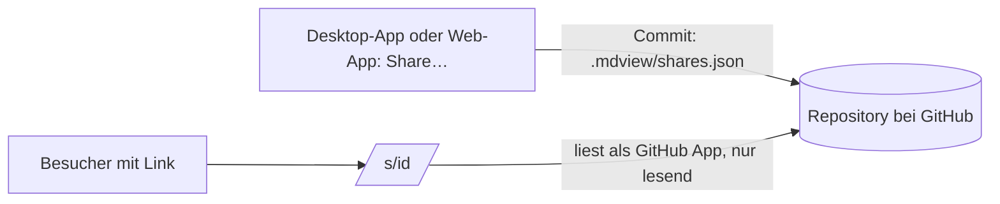

# Notizen teilen

Eine Notiz unter einem Link veröffentlichen: für alle, die den Link haben, oder zusätzlich mit
einem Passwort. Immer nur zum Lesen, und immer nur diese eine Notiz. Baut auf [[Git-Phase-3]]
auf: Die Web-App zeigt die Notiz, die Desktop-App und die Web-App legen die Freigabe an.

> [!important] Stand
> Gebaut und geprüft (8 Tests in `web/test/share.test.mjs` und `auth.test.mjs`, einer in
> `src-tauri/src/share.rs`, `dev/rig.sh share` am Desktop). Der Schlüssel der GitHub App liegt
> seit dem 6. Oktober 2026 als Secret `GITHUB_APP_PRIVATE_KEY` bei Firebase und ist in
> `web/apphosting.yaml` eingeschaltet. Gegen das echte GitHub ist ein Link geprüft (6. Oktober
> 2026, `CPUs` aus `md-view-test-notes`): Er zeigt die Notiz ohne Anmeldung, andere Dateien des
> Repositorys kommen nicht. Passwort, Aufheben und der Weg vom Desktop stehen aus.

## Was es tut

- **Der Teilen-Knopf** oben rechts, zwischen Lupe und Modus-Schalter, und **Share…** im Menü
  einer Notiz (Rechtsklick in der Seitenleiste): ein kleines Fenster mit dem Link und „Stop
  Sharing"; das Passwort ist eine Zeile darin, die man aufklappt. In der Web-App und in der Desktop-App dasselbe Fenster.
- **Was geteilt ist, sieht man:** Die Notiz trägt in der Seitenleiste ein kleines Zeichen am
  Ende ihrer Zeile, und der Teilen-Knopf ist gefärbt, solange sie gezeigt wird.
- Der Link ist sehr kurz: `https://<web-app>/s/<id>`. Die ID ist **ein** Buchstabe oder eine
  Ziffer, solange weniger als 30 Notizen geteilt sind, danach zwei (und eine Stelle mehr, sobald
  die Hälfte vergeben ist). Der Server vergibt sie (`/share/free`), weil eine ID über alle
  Repositories hinweg nur einmal vorkommen darf.
- Mit Passwort fragt die Seite zuerst danach. Nach fünf falschen Versuchen wird für diesen Link
  eine Weile keines mehr angesehen.
- Der Link zeigt immer den **aktuellen Stand** der Notiz (mit bis zu einer halben Minute
  Verzug). Wird sie umbenannt, zeigt er sie weiter; wird sie gelöscht oder die Freigabe
  aufgehoben, zeigt er nichts mehr.

> [!warning] Ein so kurzer Link lässt sich erraten
> Wer die Adresse der Web-App kennt, kann `/s/a`, `/s/b`, … durchprobieren und findet jede
> geteilte Notiz, die kein Passwort hat. „Für alle mit dem Link" heißt damit praktisch „für
> alle". Was nicht jeder lesen soll, braucht ein Passwort. So entschieden am 6. Oktober 2026;
> vorher waren die IDs zufällig und lang.

## Was mit einer Notiz mitgeht

| Mit geteilt | Nicht geteilt |
|---|---|
| die Notiz selbst | jede andere Notiz, auch wenn die geteilte auf sie verlinkt |
| ihre Bilder (``, ``) | Dateien, auf die sie nur im Fließtext verlinkt (auch PDFs) |
| ihre Datei-Blöcke (ein Absatz, der nur ein Link auf eine Datei ist) | |
| was sie einbettet (`![[…]]`): Notizen, PDFs, Bilder – und deren Bilder und Einbettungen | die Seitenleiste, die Suche, der Verlauf |

Links auf andere Notizen sind in der geteilten Notiz zu sehen, führen aber nirgendhin („This was
not shared with the note"). Der Server gibt unter einem Link nur die Dateien dieser Liste
heraus; alles andere ist 404, auch `.mdview/shares.json`.

> [!warning] Ein eingebettetes PDF geht ganz mit
> Auch wenn nur eine Seite eingebettet ist: Der Betrachter braucht die ganze Datei.

## Wie es gebaut ist

- **Kein Datenbestand auf dem Server.** Was geteilt ist, steht im Repository selbst, in
  `.mdview/shares.json`: je Freigabe die ID, der Pfad der Notiz, und von einem Passwort nur sein
  PBKDF2-SHA256 (600 000 Runden, mit Salz). Teilen, Passwort ändern und Aufheben sind Commits
  wie jede andere Änderung.
- **Die ID allein nennt die Notiz.** Der Server liest dafür die Freigabelisten aller
  Repositories, auf denen die App installiert ist, und merkt sich, welche ID wohin gehört
  (im Speicher, nicht auf Platte). Eine unbekannte ID lässt ihn neu nachsehen, höchstens alle
  fünf Sekunden. Daten und Dateien der Notiz liegen unter der langen Adresse
  `/s/<konto>/<repository>/<id>/…`, die ebenfalls als Link gilt.
- **Der Server liest als GitHub App**, nicht als Nutzer: Mit dem privaten Schlüssel der App holt
  er sich für genau das eine Repository ein Token, das nur lesen darf (`web/lib/app.ts`).
- **Die geteilte Notiz läuft in derselben Seite** wie die App, mit einer eigenen, kleinen Hülle
  (`web/public/host/share.js`): Sie kennt nur den Text der Notiz und wohin ihre Verweise führen,
  und schreibt nichts. Skripte in der Notiz laufen nicht, Dateien kommen abgeschottet.
- **Das Passwort** wird einmal eingegeben; danach trägt der Browser sieben Tage ein Cookie, das
  nur für diesen Link und dieses Passwort gilt. Ein geändertes Passwort macht es ungültig.
- **Beim Laden** zeigt das ganze Fenster einen Ring (nach 300 ms, damit nichts aufblitzt, wenn
  es schnell geht); er blendet aus, sobald die Notiz da ist.
- **Nur lesen:** Die Knöpfe für Quelltext, aktiven Modus, „Insert and Format" und die
  Einstellungen gibt es dort nicht, und die Tasten dafür tun nichts (`MdHost.reading`). Gliederung und Suche bleiben.
- **Der Link verrät sich nicht weiter:** `Referrer-Policy: no-referrer`, und Suchmaschinen wird
  gesagt, die Seite nicht aufzunehmen.

| Wo | Was |
|---|---|
| `active/share.js` | das Fenster, für beide Hüllen |
| `src-tauri/src/share.rs` | Desktop: die Datei lesen und schreiben, der Link |
| `web/public/host/host.js` | Web: dasselbe, als Commit |
| `web/lib/app.ts`, `web/lib/share.ts` | Server: Token als App; Freigabe lesen, Passwort prüfen |
| `web/app/s/[owner]/[repo]/[id]/` | die Seite hinter dem Link, ihre Daten, ihre Dateien |

## Grenzen

- **Nur Projekte, die mit GitHub verknüpft sind.** Am Desktop sagt das Fenster sonst, was fehlt.
  Der Link gilt erst, wenn der Commit bei GitHub angekommen ist; so lange steht das im Fenster.
- **Wer das Repository lesen kann, sieht, was geteilt ist** – und den Hash eines Passworts. Bei
  einem öffentlichen Repository also jeder. Ein kurzes Passwort lässt sich dann durchprobieren.
- **Aufheben wirkt mit bis zu einer halben Minute Verzug** (so lange merkt sich der Server, was
  er gelesen hat). Was ein Besucher schon geladen hat, hat er.
- **Bei sehr vielen Repositories** dauert das erste Öffnen eines Links nach einem Neustart des
  Servers: Er liest dann jede Freigabeliste einmal.
- **Kein Ablaufdatum, keine Liste aller Freigaben** im Fenster. Die Datei lässt sich lesen.
- **Ordner und ganze Repositories** lassen sich nicht teilen. So entschieden.

## Der Schlüssel

Angelegt am 6. Oktober 2026: in den Einstellungen der GitHub App unter **Private keys** erzeugt,
mit `npx firebase-tools apphosting:secrets:set GITHUB_APP_PRIVATE_KEY --data-file <.pem>` bei
Firebase hinterlegt, dem Backend `mdview` freigegeben. Geht er verloren oder soll er gewechselt
werden: an derselben Stelle einen neuen erzeugen, denselben Befehl noch einmal, den alten bei
GitHub löschen.

## Durchklicken

- [ ] Web: der Teilen-Knopf oben (zwischen Lupe und Modus) › „Share": Der Link steht da; in einem privaten Fenster geöffnet zeigt er die Notiz, ohne Anmeldung
- [ ] Ein Bild und eine eingebettete Notiz erscheinen; ein Link auf eine andere Notiz sagt „This was not shared with the note"
- [ ] Passwort setzen: Das private Fenster fragt danach; falsch wird abgelehnt, richtig öffnet
- [ ] Die Notiz ändern: Der Link zeigt nach einer halben Minute und Neuladen den neuen Stand
- [ ] „Stop Sharing": Der Link zeigt „Nothing here"
- [ ] Desktop: dasselbe Fenster; der Link gilt, sobald der Abgleich durch ist
- [ ] Die Adresse einer Datei raten (`…/file/<andere Notiz>.md`): 404
